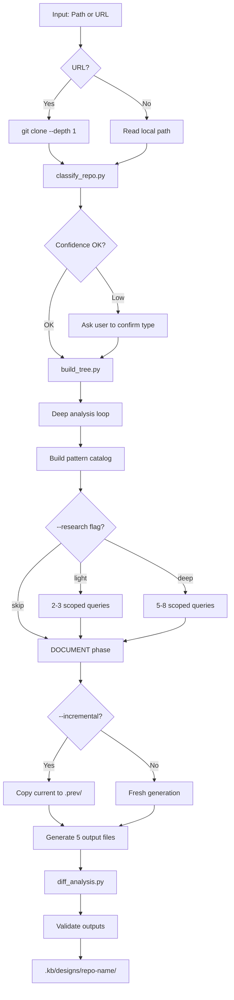
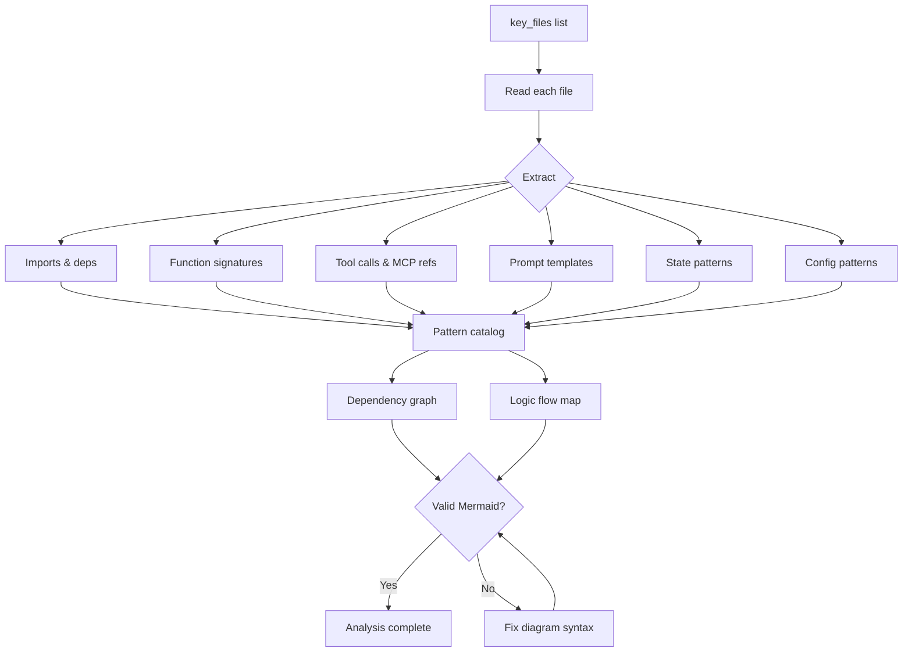
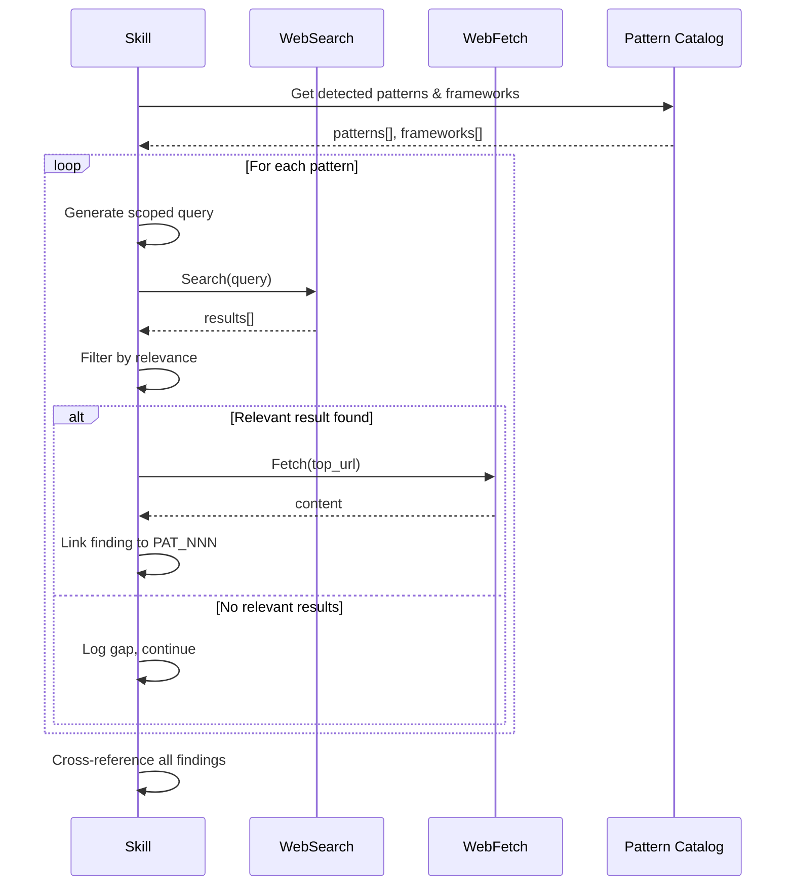
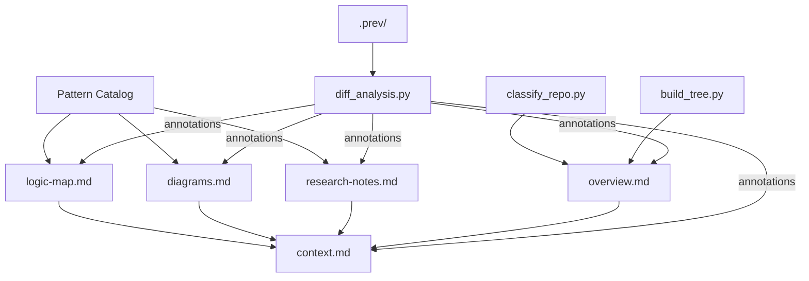
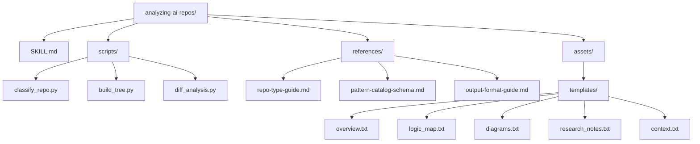
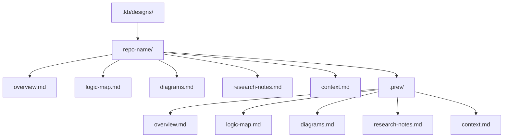

# Analyzing AI Repos — Diagrams

## Logic: Four-Phase Pipeline

## Flows: ANALYZE Phase Detail

## Flows: RESEARCH Phase Detail

## Relationships: Output Document Dependencies

## Structure: Skill Directory Layout

## Structure: Output Document Layout

