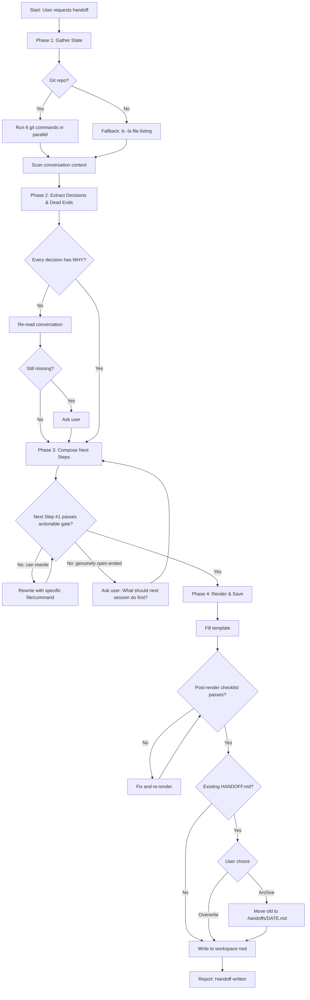
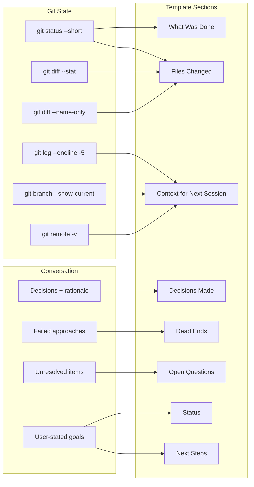
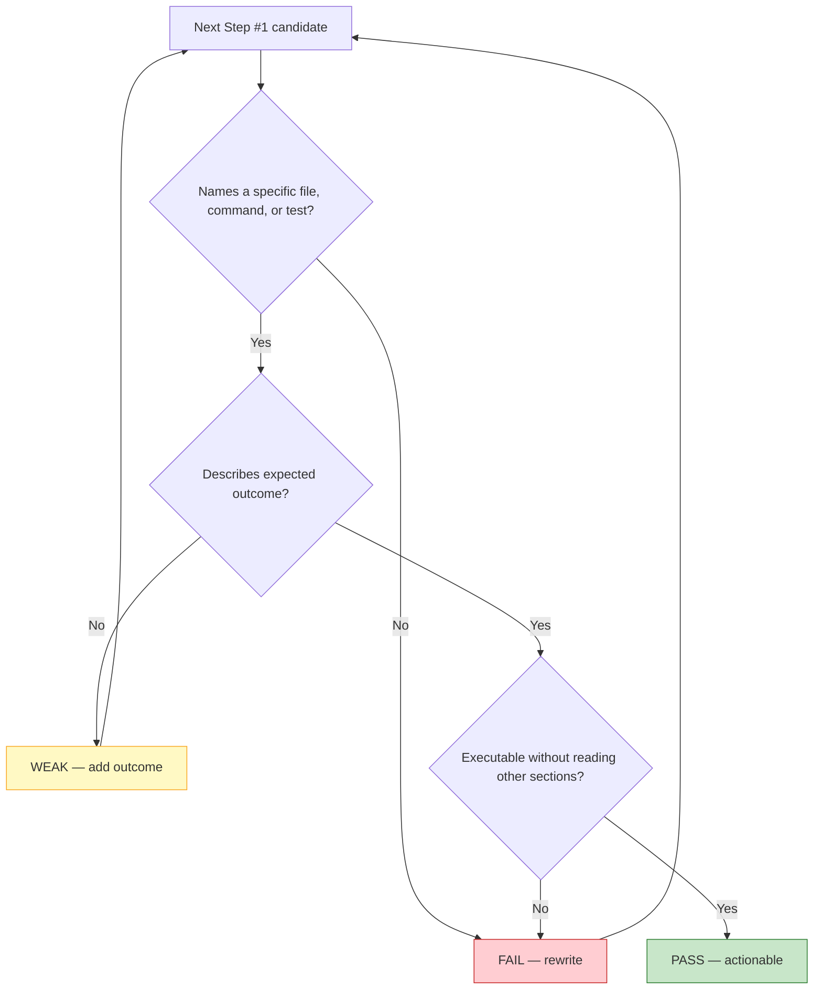
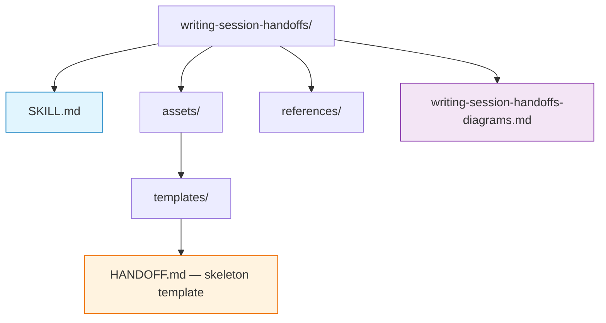

# Writing Session Handoffs — Diagrams

## Logic: Phase Flow with Validation Gates

## Flow: Data Sources → Template Sections

## Relationships: Validation Gate Detail (Next Step #1)

## Structure: Output File Layout

