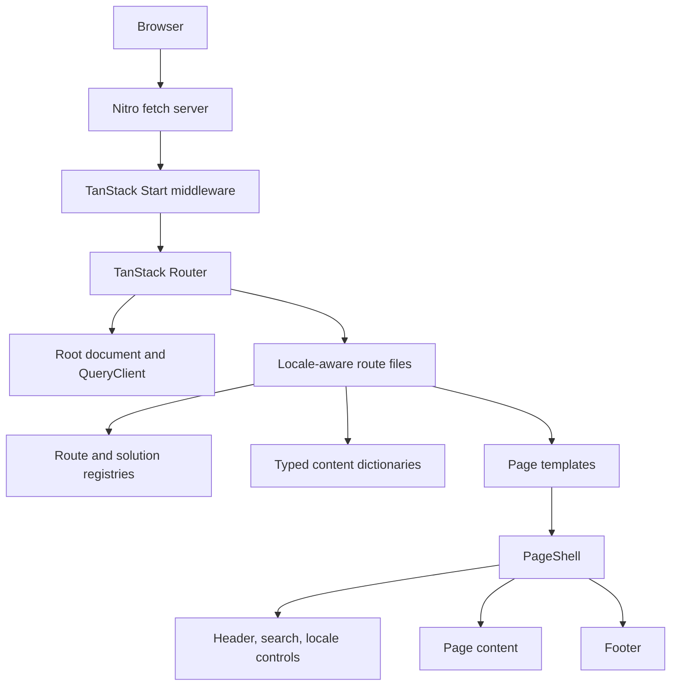
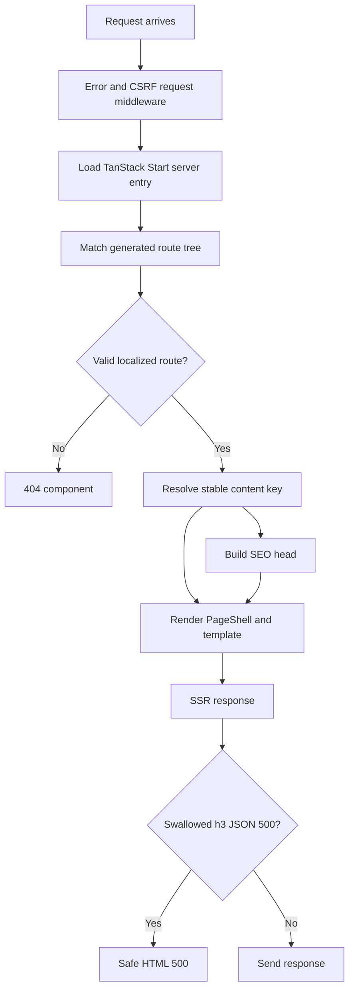
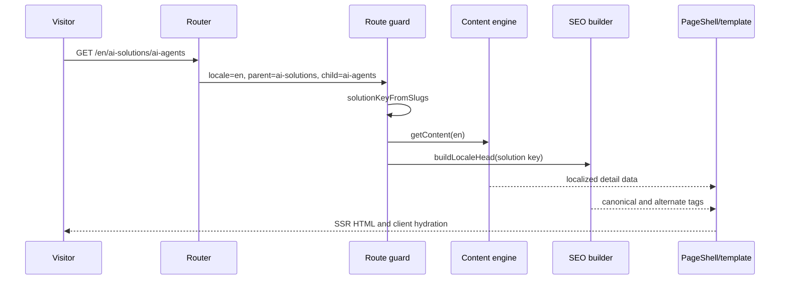
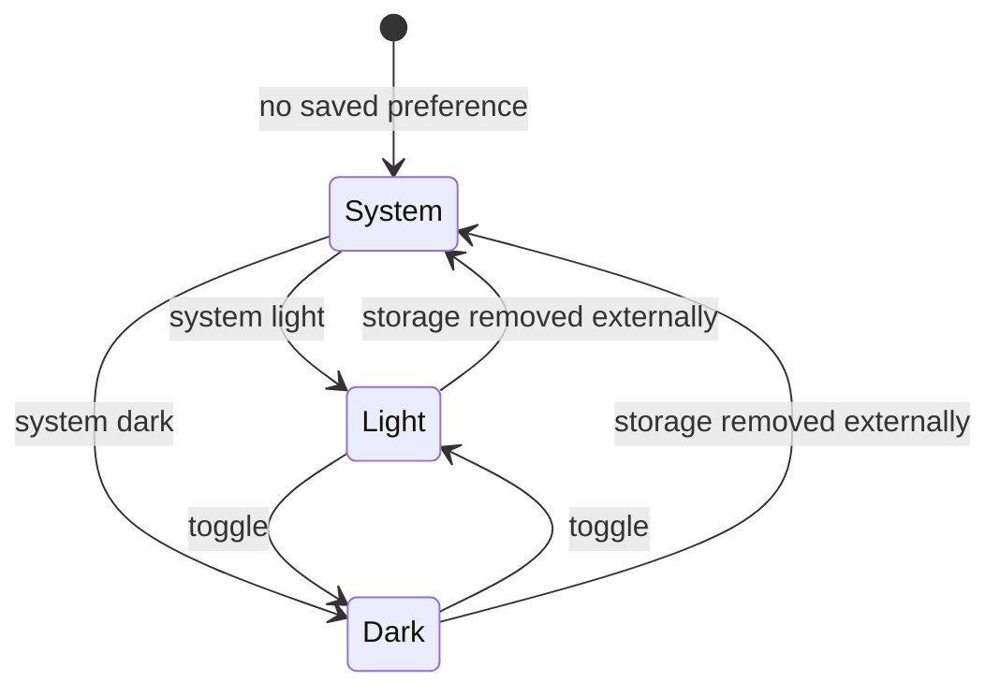

# STP72-company — Diagrams

## Component Map

`src/routeTree.gen.ts` is generated from the four route files. It should be regenerated by the bundler, never hand-edited. File-based routing and generated trees are the intended TanStack Router model; see the [official routing documentation](https://tanstack.com/router/latest/docs/routing/file-based-routing).

## Execution Flow

The two failure paths are intentionally different: a known missing localized slug is a 404; an unexpected runtime failure becomes a generic HTML 500 without leaking details.

## Sequence Diagram

## State Diagram: Theme Preference

The initial inline document script applies the saved/system result before first paint. The provider then maintains the state and listens for operating-system changes only when preference is `system`.
