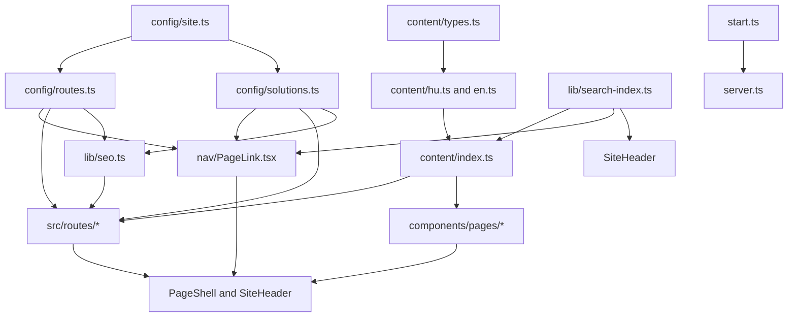
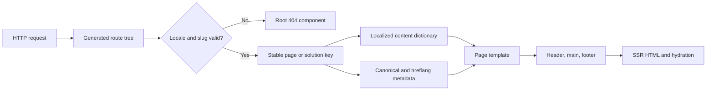

# STP72-company — Logic Map

## Module Dependencies

| Source module                     | Depends on                                   | Type                                | Evidence                                        |
| --------------------------------- | -------------------------------------------- | ----------------------------------- | ----------------------------------------------- |
| `routes/$locale/$slug.index.tsx`  | route registry, content, SEO, page templates | slug resolution + template dispatch | `beforeLoad`, `head`, `LocalePage`              |
| `routes/$locale/$slug.$child.tsx` | solution taxonomy, content, SEO              | guarded nested detail route         | `solutionKeyFromSlugs`                          |
| `PageLink.tsx`                    | route and solution registries                | typed navigation boundary           | `PageLink`, `SolutionLink`, `useNavigateToPage` |
| `search-index.ts`                 | content + taxonomy                           | deterministic client search index   | `buildSearchIndex`                              |
| `PageShell.tsx`                   | theme, header, footer                        | shared outer layout                 | `PageShell`                                     |
| `server.ts`                       | Start server entry + error utilities         | SSR failure containment             | `normalizeCatastrophicSsrResponse`              |

## Data Flow

| Stage           | Input                      | Processing                                                                         | Output         | Files                              |
| --------------- | -------------------------- | ---------------------------------------------------------------------------------- | -------------- | ---------------------------------- |
| URL match       | pathname                   | TanStack file routing                                                              | route params   | `src/routes`, `routeTree.gen.ts`   |
| Guard           | `locale`, `slug`, `child`  | validates locale and reverse-resolves slugs                                        | key or 404     | route files; route/solution config |
| Content         | stable key + locale        | selects complete dictionary object                                                 | localized data | `src/content/index.ts`             |
| Presentation    | content + taxonomy         | chooses home, generic, service, catalogue, detail, process, or reference component | React tree     | `components/pages/*`               |
| Metadata        | locale + page/solution key | derives canonical and alternate paths                                              | `<head>` tags  | `src/lib/seo.ts`                   |
| Server recovery | Response/error             | converts unexpected SSR failures to safe HTML                                      | controlled 500 | `src/start.ts`, `src/server.ts`    |

## Control Flow

| Decision point    | Condition                                                        | True path              | False path        | File                  |
| ----------------- | ---------------------------------------------------------------- | ---------------------- | ----------------- | --------------------- |
| Root redirect     | request is `/`                                                   | redirect to `/hu`      | n/a               | `routes/index.tsx`    |
| Route validity    | locale and slug map to a key                                     | render matching page   | 404               | localized route files |
| Page template     | key is `solutions`, `references`, `how-we-work`, or service page | dedicated template     | generic `SubPage` | `$slug.index.tsx`     |
| Detail validity   | parent/child pair belongs to same family in the active locale    | render detail template | 404               | `$slug.$child.tsx`    |
| SSR normalization | 500 JSON has h3 `HTTPError` shape                                | render safe HTML page  | preserve response | `server.ts`           |

## Integration Points

| External system                     | Protocol                  | Purpose                                       | Files                               |
| ----------------------------------- | ------------------------- | --------------------------------------------- | ----------------------------------- |
| Google Fonts                        | HTTPS stylesheet          | IBM Plex Sans and Mono                        | `routes/__root.tsx`                 |
| Browser local storage / media query | Web APIs                  | persisted or system theme                     | `lib/theme.ts`, `ThemeProvider.tsx` |
| Browser history / TanStack router   | SPA navigation            | typed locale-aware navigation                 | `PageLink.tsx`, `SiteSearch.tsx`    |
| GitHub Actions                      | OIDC + AWS CLI            | verify, build, push image, trigger deployment | `.github/workflows/deploy-aws.yml`  |
| Amazon ECR / ECS Express Mode       | container image + AWS API | intended production delivery                  | `Dockerfile`, workflow              |

## Pattern Connections

| Pattern                          | Connects to          | Relationship                                                | Evidence                                    |
| -------------------------------- | -------------------- | ----------------------------------------------------------- | ------------------------------------------- |
| PAT_001 localized route registry | PAT_003 route guards | a guard reverses the registry mapping                       | `pageKeyFromSlug`, `solutionKeyFromSlugs`   |
| PAT_001 localized route registry | PAT_005 SEO          | alternate URLs derive from the same mapping                 | `buildLocaleHead`                           |
| PAT_002 typed content engine     | PAT_004 templates    | templates render only dictionary data                       | `getContent` use across page components     |
| PAT_002 typed content engine     | PAT_006 search       | search indexes the exact published localized data           | `buildSearchIndex`                          |
| PAT_008 SSR resilience           | PAT_009 delivery     | custom server entry is required by the Node container image | `vite.config.ts`, `server.ts`, `Dockerfile` |
