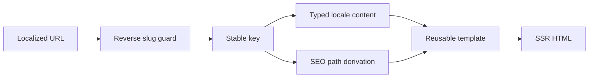

# STP72-company — Summary Card

| Field              | Value                                                  |
| ------------------ | ------------------------------------------------------ |
| **Repo**           | STP72-company                                          |
| **URL**            | https://github.com/STP72-dev/STP72-company             |
| **Type**           | localized SSR corporate web platform (high confidence) |
| **Language**       | TypeScript                                             |
| **Stack**          | TanStack Start, React 19, Vite/Nitro, Tailwind CSS v4  |
| **Analyzed**       | 2026-08-31                                             |
| **Research depth** | deep                                                   |

## Top 5 Patterns

|   # | Pattern                         | Type           | Confidence | Key file                          |
| --: | ------------------------------- | -------------- | ---------- | --------------------------------- |
|   1 | localized route registry        | config-driven  | high       | `src/config/routes.ts`            |
|   2 | typed bilingual content         | schema         | high       | `src/content/types.ts`            |
|   3 | parent/child solution resolver  | routing        | high       | `src/config/solutions.ts`         |
|   4 | centralized navigation boundary | component API  | high       | `src/components/nav/PageLink.tsx` |
|   5 | SSR fault containment           | error handling | high       | `src/server.ts`                   |

## Key Diagram

## Quick Stats

| Metric                   | Value |
| ------------------------ | ----: |
| Repository files scanned |   135 |
| Analysis-scope files     |   127 |
| Patterns detected        |    10 |
| Research queries         |     8 |
| External integrations    |     4 |
| Physical route shapes    |     4 |

## One-Paragraph Summary

This repository is a content-first corporate web platform, not a dynamic AI application. Its maintainability comes from three explicit boundaries: stable keys and localized slug maps for URLs, strict locale content contracts for all visitor copy, and shared page templates for repeated structures. `PageLink`/`SolutionLink` and `buildLocaleHead` make navigation and SEO use the same taxonomy. Deployment is containerized with a GitHub Actions OIDC pipeline targeting Amazon ECR and ECS Express Mode; cloud prerequisites remain unprovisioned.

## Full Analysis

- [Overview](overview.md)
- [Logic Map](logic-map.md)
- [Diagrams](diagrams.md)
- [Research Notes](research-notes.md)
- [Context](context.md)
- [Machine-readable](analysis.json)
