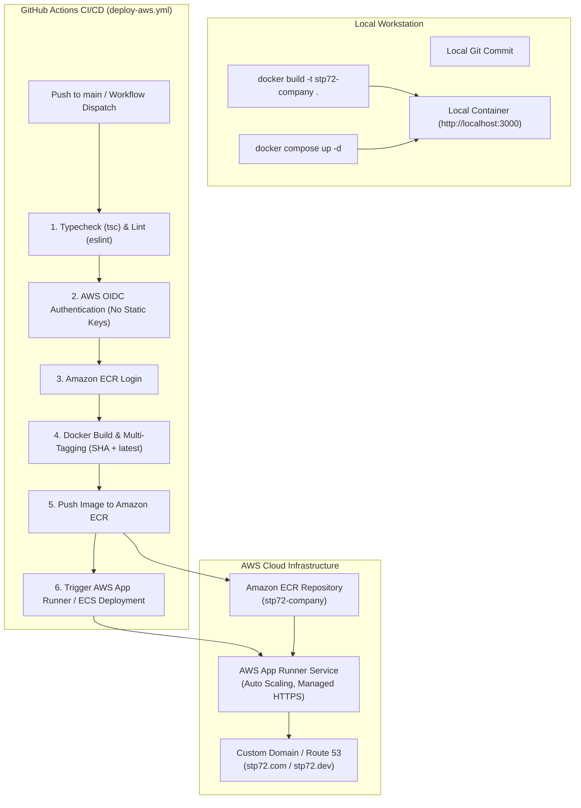

# Architecture & Execution Plan: Docker Containerization & AWS Cloud Deployment

## 1. Executive Problem Statement & Objectives

The goal is to provide a complete, enterprise-ready, containerized distribution of **STP72 Foundation** (`STP72-company`) that supports:
1. **Zero-Configuration Local Deployment**: A developer or operator can clone the repo and run the full SSR application locally via Docker & Docker Compose with full dependency encapsulation and health verification.
2. **Automated AWS Cloud Deployment from GitHub**: A secure, modern CI/CD pipeline using **GitHub Actions** with **OpenID Connect (OIDC)** (no long-lived AWS static credentials) to build multi-arch container images, push to **Amazon ECR**, and deploy to a cloud compute target with zero downtime.

---

## 2. Research & Evaluation of Options

### A. Container Base Image & Runtime Strategy

| Strategy | Base Image | Build Size | Build Speed | Security & Compatibility |
| :--- | :--- | :--- | :--- | :--- |
| **Option 1: Node.js Debian Slim (Recommended)** | `node:24-slim` / `node:22-slim` | ~150MB | Fast | High (glibc, broad native dependency compatibility, standard Nitro target) |
| **Option 2: Node.js Alpine** | `node:24-alpine` | ~110MB | Moderate | Moderate (musl libc occasionally causes issues with native rollups/SWC) |
| **Option 3: Bun Slim** | `oven/bun:1.2-slim` | ~130MB | Very Fast | High (supports Nitro standalone runner) |

*Decision*: **Multi-Stage Node.js 24 Slim** provides the greatest enterprise compatibility, robust glibc support for Vite/Rollup/Tailwind build passes, and small runtime footprints.

---

### B. AWS Compute Architecture Evaluation

| Criterion (Weight) | AWS App Runner (Option A) | Amazon ECS Fargate (Option B) | AWS Lambda Web Adapter (Option C) |
| :--- | :--- | :--- | :--- |
| **Local Parity & Simplicity (20%)** | **5 / 5** (Direct 1:1 container execution) | **4 / 5** (Requires Task def, ALB, VPC) | **3 / 5** (Function wrapper behavior) |
| **Cost for SME Traffic (25%)** | **5 / 5** (Scale-to-zero memory paused, no idle ALB cost) | **3 / 5** (Fixed base cost for ALB + Fargate tasks) | **4.5 / 5** (Pay per ms, but cold start cost) |
| **Operational Overhead (25%)** | **5 / 5** (Managed HTTPS, auto scaling, no VPC needed) | **2.5 / 5** (Complex networking, subnet routing, ALB) | **3.5 / 5** (API Gateway / Function URL management) |
| **Security & OIDC Standards (15%)** | **5 / 5** (Native ECR IAM integration) | **5 / 5** (IAM task execution roles) | **5 / 5** (IAM execution roles) |
| **SSR Streaming & Latency (15%)** | **4.8 / 5** (Low latency, persistent connection) | **5 / 5** (Persistent connection) | **3.5 / 5** (Cold start penalties on SSR HTML) |
| **Weighted Total Score (100%)** | **4.96 / 5.00** 🏆 *(Winner)* | **3.68 / 5.00** | **3.95 / 5.00** |

*Decision*: **AWS App Runner** is the optimal production cloud compute target for STP72 Foundation due to its managed simplicity, native automatic SSL/TLS, auto-scaling from 1 to N instances, zero-maintenance load balancing, and direct integration with Amazon ECR. The design also provides full compatibility with **Amazon ECS Fargate** if advanced VPC private networking is later required.

---

## 3. Detailed Architecture Plan

---

## 4. Implementation Steps & File Changes

1. **Create `Dockerfile`**:
   - Multi-stage build (`deps` -> `builder` -> `runner`).
   - Caching layer for package manifests (`package.json`, `bun.lock`).
   - Run production Nitro build (`npm run build`).
   - Hardened `runner` stage with dedicated non-root user `nodejs` (`uid: 1001`, `gid: 1001`).
   - Healthcheck integration via built-in lightweight node script or curl.
   - Configurable `PORT` and `NODE_ENV=production`.

2. **Create `.dockerignore`**:
   - Exclude `.git`, `node_modules`, `.output`, `dist`, `docs/.plan`, `*.log`, `.env*`, etc.

3. **Create `docker-compose.yml`**:
   - Production container definition with port `3000:3000`, environment variables, healthchecks, restart policy.
   - Optional `development` override profile for live volume mounting if requested.

4. **Create `.github/workflows/deploy-aws.yml`**:
   - Production deployment pipeline configured with OIDC `role-to-assume`.
   - Multi-stage job: verification gate -> build & push to ECR -> update AWS App Runner service.

5. **Create & Update Documentation in `docs/`**:
   - Add `docs/10-deployment-and-cloud-infrastructure.md` covering local Docker guide, AWS App Runner setup, ECR provisioning, GitHub Actions OIDC role configuration, and troubleshooting.
   - Update `docs/README.md` to index Chapter 10.
   - Update `docs/07-operations-build-and-deployment.md` to reference the containerized and cloud deployment pipelines.
   - Update `AGENTS.md` and `README.md` with Docker commands.

6. **Validation & Verification**:
   - Run `validate.py . --strict`.
   - Run type checks and build checks.
