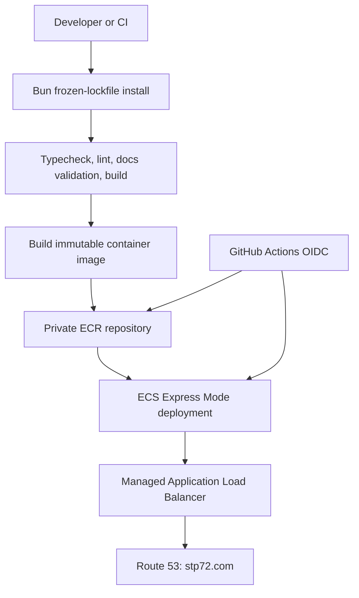

# Approved Plan: Deterministic Containers and AWS ECS Express Mode

> **Status:** repository implementation complete; AWS/GitHub prerequisite configuration pending
>
> **Decision date:** 2026-08-31
>
> **Scope:** deployment planning and documentation only. No AWS resource was created by this plan.

## 1. Executive Decision

STP72 Foundation will use **Amazon ECS Express Mode** backed by a private Amazon ECR repository in `eu-central-1`. This replaces the earlier App Runner-first plan.

AWS App Runner is closed to new customers. Its continuation therefore depends on prior account eligibility, which this account does not need to rely on. AWS recommends ECS Express Mode as its App Runner migration path; Express Mode accepts a container image and provisions the ECS-on-Fargate service, Application Load Balancer, networking, and autoscaling defaults. See the [AWS availability change](https://docs.aws.amazon.com/apprunner/latest/dg/apprunner-availability-change.html) and [ECS Express Mode guide](https://docs.aws.amazon.com/AmazonECS/latest/developerguide/express-service-create-full.html).

**Canonical package manager: Bun.** `bun.lock` and `bunfig.toml` are already committed and configure a 24-hour minimum release age for supply-chain protection. Future local, CI, and container build installation must use Bun's frozen lockfile mode. Node.js 24 remains the production runtime for the Nitro server.

## 2. Verified Current State

| Item                   | State on 2026-08-31                                                                                                         | Consequence                                                                                                                         |
| ---------------------- | --------------------------------------------------------------------------------------------------------------------------- | ----------------------------------------------------------------------------------------------------------------------------------- |
| AWS login              | Successful, but the active identity is the account root principal.                                                          | Discovery is complete; stop before provisioning and use an administrative IAM Identity Center user or assumed role for normal work. |
| ECR repository         | `stp72-company` does not exist in `eu-central-1`.                                                                           | Create it in the infrastructure phase.                                                                                              |
| App Runner             | No services exist.                                                                                                          | App Runner is not the selected target.                                                                                              |
| ECS                    | No clusters exist.                                                                                                          | ECS Express Mode will create/use its required resources during setup.                                                               |
| Route 53               | Public hosted zone `stp72.com.` exists.                                                                                     | DNS and certificate validation can be completed after the service endpoint exists.                                                  |
| GitHub Actions         | Run `33301445214` failed in `actions/setup-node`.                                                                           | No image was built, pushed, or deployed.                                                                                            |
| CI failure             | npm caching failed because no npm/yarn lockfile exists.                                                                     | The workflow is blocked before `npm ci`, which would also fail.                                                                     |
| Dependency artifacts   | `bun.lock` and `bunfig.toml` exist; no `package-lock.json`.                                                                 | Bun is the supported deterministic-install source of truth.                                                                         |
| Current implementation | Dockerfile uses Bun frozen-lockfile installation; workflow uses Bun validation, ECR image push, and ECS Express deployment. | It cannot deploy until its AWS roles, ECR repository, and GitHub variables are configured.                                          |

`npm ci` requires `package-lock.json` or `npm-shrinkwrap.json`; it cannot consume `bun.lock`. [npm documentation](https://docs.npmjs.com/cli/v11/commands/npm-ci/)

## 3. Package Manager Decision

| Option             | Pros                                                                                                                                                                     | Cons                                                                                                                                                                                  |
| ------------------ | ------------------------------------------------------------------------------------------------------------------------------------------------------------------------ | ------------------------------------------------------------------------------------------------------------------------------------------------------------------------------------- |
| **Bun — selected** | Existing lockfile and configuration; one dependency source of truth; `bun install --frozen-lockfile` protects reproducibility; release-age policy is already configured. | Bun must be installed in local development, CI, and the Docker builder; all build/test commands must be verified under Bun.                                                           |
| npm                | Existing Dockerfile and workflow already invoke npm; Node-only builder images are familiar.                                                                              | Requires creating and maintaining a second lockfile or migrating away from `bun.lock`; current CI is already broken; `npm install` in Docker is non-deterministic with semver ranges. |

**Verdict:** retain Bun as the sole dependency installer and lockfile authority. Use a Bun builder stage or install Bun in the builder stage, then copy only Nitro's `.output` artifact into the existing non-root Node 24 runtime image. Do not maintain both lockfiles.

## 4. Target Architecture

ECS Express Mode requires an image plus a task execution role and an infrastructure role. The task execution role pulls private images and writes logs; Express Mode creates a public ALB in the default VPC/public subnets unless networking is explicitly customized. [AWS ECS guide](https://docs.aws.amazon.com/AmazonECS/latest/developerguide/express-service-getting-started.html)

## 5. Delivery Principles

- Use GitHub OIDC and short-lived credentials; never add static AWS access keys to GitHub.
- Do not use the AWS account root principal for routine infrastructure work. Create/use an administrative federated identity with temporary credentials and keep root access for root-only account tasks. [AWS root-user guidance](https://docs.aws.amazon.com/IAM/latest/UserGuide/root-user-best-practices.html)
- Restrict the IAM trust policy to `aud=sts.amazonaws.com` and `sub=repo:STP72-dev/STP72-company:environment:production`. Configure the GitHub `production` environment to allow only the `main` branch and require reviewers. [GitHub OIDC guidance](https://docs.github.com/en/actions/how-tos/secure-your-work/security-harden-deployments/oidc-in-aws)
- Build and deploy an immutable Git-SHA image reference or digest. Do not rely on a mutable `latest` tag for rollback.
- Configure ECR image scanning and a lifecycle policy. ECR supports scan-on-push and tag immutability, but fully immutable tags must not be combined with a repeatedly overwritten `latest` tag. [AWS ECR guidance](https://docs.aws.amazon.com/AmazonECR/latest/userguide/image-tag-mutability.html)
- Keep the non-root Node runtime and `NITRO_PRESET=node-server` behavior.
- Treat `/hu` as the initial verified HTTP health path. Add a lightweight dedicated health route only as a separately tested application change.

## 6. Looped End-to-End Plan

Every phase follows **inspect → change → validate → update risks → continue or stop**. Do not advance until its exit criterion is true.

| Phase                              | Actions                                                                                                                                                                | Validation and exit criterion                                                                                                                                                        | Failure path / rollback                                                                                        |
| ---------------------------------- | ---------------------------------------------------------------------------------------------------------------------------------------------------------------------- | ------------------------------------------------------------------------------------------------------------------------------------------------------------------------------------ | -------------------------------------------------------------------------------------------------------------- |
| 1. Reconfirm baseline              | Run read-only AWS and GitHub checks; preserve uncommitted analysis/handoff work; replace the root session with an administrative federated identity before any change. | Identity, region, absent ECR/ECS state, hosted zone, and non-root operator identity are recorded.                                                                                    | Stop if the identity is root, the account/region is wrong, or ECS Express Mode is not available in the region. |
| 2. Repair source reproducibility   | Convert CI and Docker builder to Bun; use `bun install --frozen-lockfile`; align CI/build Node runtime policy.                                                         | Docker build and type check passed locally. Repository-wide lint is currently blocked by 106 pre-existing Prettier violations in `src/`; correct those before the first release run. | Revert only the CI/container change if checks fail.                                                            |
| 3. Define release semantics        | Use SHA tag/digest; decide ECR scanning, retention, and tag mutability rules.                                                                                          | One release identifier unambiguously resolves to one image.                                                                                                                          | Retain the last known good images.                                                                             |
| 4. Create AWS prerequisites        | Create ECR, OIDC provider/role, ECS task execution role, and ECS infrastructure role with least privilege.                                                             | OIDC trust permits only the protected `production` environment; the environment permits only `main`; ECR accepts the deployment role.                                                | Remove unused new resources only with explicit approval.                                                       |
| 5. Deploy a controlled first image | Push one verified image and create the ECS Express service at port `3000`, with a HTTP health check to `/hu`.                                                          | Service reports healthy, endpoint returns HTTP 200, and logs show successful Nitro startup.                                                                                          | Redeploy the prior immutable image reference.                                                                  |
| 6. Exercise operations             | Verify logs, image scans, deployment status, autoscaling defaults, and documented rollback.                                                                            | A prior release can be selected and restored without rebuilding it.                                                                                                                  | Keep current stable service and retained prior image.                                                          |
| 7. Cut over the domain             | Associate `stp72.com` or a chosen subdomain, publish Route 53 records, wait for certificate/DNS validation, then test HTTPS.                                           | Domain association is Active and serves the expected SSR page.                                                                                                                       | Restore prior Route 53 record target.                                                                          |

## 7. Required Implementation Changes

| File                                             | Required change                                                                                                                              | Why                                                                                 |
| ------------------------------------------------ | -------------------------------------------------------------------------------------------------------------------------------------------- | ----------------------------------------------------------------------------------- |
| `Dockerfile`                                     | Completed: deterministic Bun installation using `bun.lock`, with a Node 24 non-root runtime retained.                                        | The container build now shares the chosen dependency source of truth.               |
| `.github/workflows/deploy-aws.yml`               | Completed: Bun validation, SHA-only ECR push, protected production environment, and ECS Express create/update deployment.                    | The workflow now has a deployment path; AWS/GitHub configuration is still required. |
| `README.md`                                      | Make Bun the primary install/build workflow; leave npm only as an explicitly unsupported alternative until a lockfile migration is approved. | Prevents contributors recreating the failed npm path.                               |
| `docs/10-deployment-and-cloud-infrastructure.md` | Document the current/target distinction, ECS Express roles, release/rollback model, and Route 53 cutover.                                    | Maintains an operationally truthful runbook.                                        |

## 8. Immediate Next Step

Configure the GitHub `production` environment and required repository variables, then run the workflow manually on this implementation commit. Its definition of done is a successful GitHub validation job; the environment gate must approve the first AWS resource creation separately.
