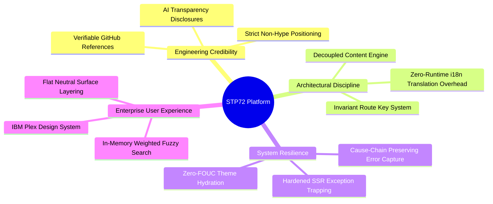
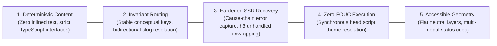

# Chapter 01: Executive Summary & System Rationale

## 1.1 Executive Overview

**STP72 Foundation** (`STP72-company`) is an enterprise digital web application and solutions architecture catalogue. It serves as the primary digital touchpoint, technical showcase, and capability directory for **STP72**—a technology consultancy and software engineering firm specializing in AI automation, custom business systems, data warehousing, and forecasting for small and medium-sized enterprises (SMEs).

The platform is engineered using modern web technologies: **TanStack Start** (fullstack SSR framework), **React 19**, **Vite 8**, **TypeScript 5.8**, and **Tailwind CSS v4**. It rejects generic marketing templates in favor of a bespoke, precision-engineered system built around a strict IBM Plex/Carbon design aesthetic and a decoupled, schema-driven content engine.



---

## 1.2 The Problem Space & Strategic Positioning

### The SME Digital Dilemma

Small and medium-sized enterprises frequently encounter a technological ceiling where off-the-shelf software (spreadsheets, basic ERPs, disjointed SaaS tools) breaks down under operational scale:

1. **Spreadsheet Fragility**: Critical processes (inventory, production scheduling, asset tracking) run on uncontrolled spreadsheets vulnerable to data corruption.
2. **AI Hype vs. Utility**: Companies struggle to adopt artificial intelligence due to inflated vendor promises, lack of structured data, and high risks of hallucination.
3. **Data Fragmentation**: Business data is siloed across legacy accounting tools, CRM systems, and isolated databases, preventing reliable operational forecasting.

### STP72's Rationale & Differentiators

The STP72 platform is designed from the ground up to reflect a pragmatic, evidence-based engineering philosophy:

- **Evidence-Based Engineering**: The platform never quotes fabricated metrics or anonymous client testimonials. Instead, it anchors capabilities to verifiable public engineering repositories, reference architectures, prototypes, and demonstrators (see [`src/config/site.ts:L30-33`](../src/config/site.ts#L30-L33)).
- **Operational Fit First**: Rather than demanding total system replacement, solutions are structured to fit existing environments step-by-step.
- **Radical AI Transparency**: Every AI-driven capability includes explicit verification rules, boundary conditions, and human-in-the-loop approval requirements (embodied in [`src/components/ds/AILabel.tsx:L1-93`](../src/components/ds/AILabel.tsx#L1-L93)).

---

## 1.3 Core Architectural Principles

The technical implementation of the STP72 platform adheres to five strict architectural principles:



### 1. Zero Inlined Content & Full Type Safety

Component files contain purely structural layout logic and event handling. Every heading, descriptive text, SEO tag, and navigation label is imported from strongly-typed data contracts in [`src/content/types.ts`](../src/content/types.ts). This guarantees compile-time validation for missing translations and broken schema definitions.

### 2. Invariant Route Keys & True i18n

Routing is decoupled from localized URL strings. Pages and nested solutions possess immutable conceptual identifiers (`ai-solutions`, `inventory-wms`, etc.). When a user switches languages on any nested subpage, the system resolves the counterpart slug without losing location context or crashing routes.

### 3. Server-Side Resilience

Modern serverless engines often catch and swallow server-side rendering errors into ambiguous `500 HTTPError` JSON payloads. The STP72 server layer intercepts swallowed responses, recovers the full nested error cause-chain, logs the stack trace, and serves an emergency fallback page without exposing internals to the user.

### 4. Zero Flash of Unstyled Content (Zero-FOUC)

Theme preferences (`light`, `dark`, or system default) are evaluated synchronously in the HTML `<head>` prior to first layout pass, eliminating visual theme flickering during SSR rehydration.

### 5. High-Contrast, Accessible Visual Discipline

Inspired by IBM Carbon Design System, the UI enforces rectangular geometry (`0px` border radius), 8px spatial rhythm, multi-layer surface contrasts (`--layer-01`, `--layer-02`, `--layer-03`), and non-color dependent accessibility indicators (`●`, `▲`, `■`, `◆`).

---

## 1.4 Technology Stack Summary

| Layer                 | Technology                                                  | Version         | Rationale                                                                   |
| :-------------------- | :---------------------------------------------------------- | :-------------- | :-------------------------------------------------------------------------- |
| **Framework**         | [TanStack Start](https://tanstack.com/start)                | `1.168.32`      | Fullstack SSR, file-based routing, server functions, streaming rehydration. |
| **Routing**           | [TanStack Router](https://tanstack.com/router)              | `1.170.18`      | Type-safe search params, nested route layouts, preload lifecycle hooks.     |
| **UI Library**        | [React](https://react.dev/)                                 | `19.2.0`        | Latest concurrent rendering features, Actions, enhanced SSR hydration.      |
| **Bundler & Server**  | [Vite](https://vite.dev/) / [Nitro](https://nitro.unjs.io/) | `8.1.5` / `3.0` | Sub-millisecond HMR, zero-config SSR builds, multi-target cloud deployment. |
| **Language**          | [TypeScript](https://www.typescriptlang.org/)               | `5.8.3`         | Strict compiler checks (`strict: true`, `exactOptionalPropertyTypes`).      |
| **Styling**           | [Tailwind CSS](https://tailwindcss.com/)                    | `4.2.1`         | Next-gen CSS engine with OKLCH color token mapping and native `@theme`.     |
| **State & Query**     | [TanStack React Query](https://tanstack.com/query)          | `5.101.1`       | Async state management, server cache coordination.                          |
| **Design Primitives** | [Radix UI](https://www.radix-ui.com/)                       | Latest          | Unstyled, accessible primitives (Dialog, Sheet, Dropdown, Accordion).       |
| **Data Viz**          | [Recharts](https://recharts.org/)                           | `2.15.4`        | Responsive SVG time-series forecasting charts with confidence bands.        |
| **Icons**             | [Lucide React](https://lucide.dev/)                         | `0.575.0`       | Consistent 16px/24px line icons.                                            |

---

## 1.5 Codebase Artifact Matrix

```
STP72-company/
├── src/
│   ├── components/       # Design system primitives, page templates, header, search
│   │   ├── brand/        # Wordmark & corporate identity
│   │   ├── ds/           # Custom Design System components (AILabel, FlowDiagram, ForecastChart)
│   │   ├── layout/       # Shell, Container, Section, Header, Footer
│   │   ├── nav/          # Type-safe PageLink & SolutionLink wrappers
│   │   ├── pages/        # High-order page compositions (HomePage, ServicePage, etc.)
│   │   ├── search/       # Client-side fuzzy search dialog
│   │   ├── theme/        # ThemeProvider & ThemeToggle
│   │   └── ui/           # Radix-based atomic primitives
│   ├── config/           # Central route, solution, and site configuration
│   ├── content/          # Localization content files (en, hu, solutions) & TypeScript types
│   ├── hooks/            # Reusable UI hooks (e.g. use-mobile)
│   ├── lib/              # Runtime libraries (error capture, search index, SEO, theme)
│   ├── routes/           # File-based TanStack Start route tree
│   ├── router.tsx        # Router instantiation and QueryClient context
│   ├── server.ts         # Nitro server entrypoint and catastrophic SSR unwrapper
│   ├── start.ts          # TanStack Start instance with CSRF & error middlewares
│   └── styles.css        # Tailwind v4 theme, OKLCH tokens, design system utilities
├── public/               # Static assets, favicons, robots.txt
├── package.json          # Dependency manifest and scripts
├── vite.config.ts        # Vite & TanStack Start build configuration
└── tsconfig.json         # Strict TypeScript configuration
```
