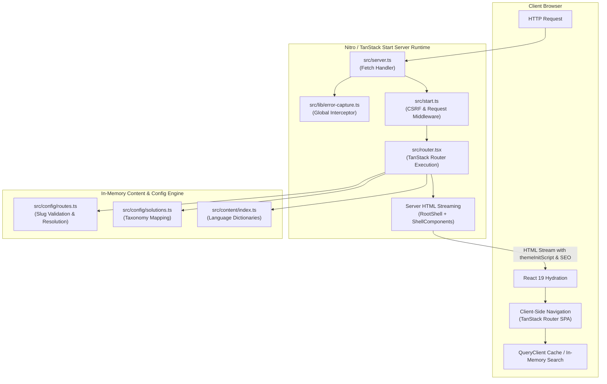
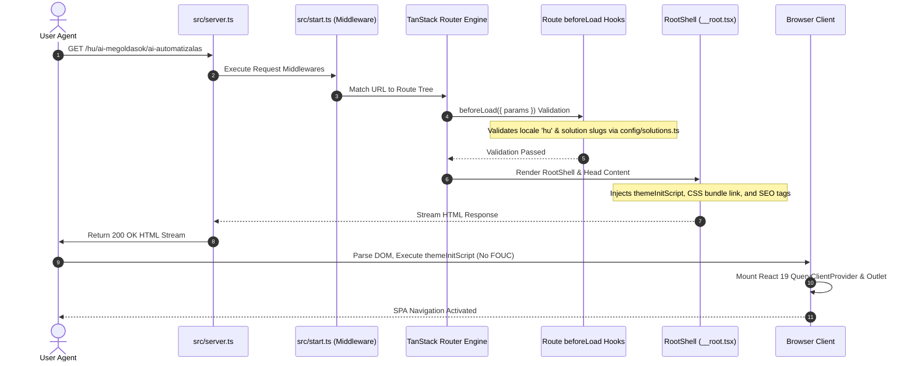
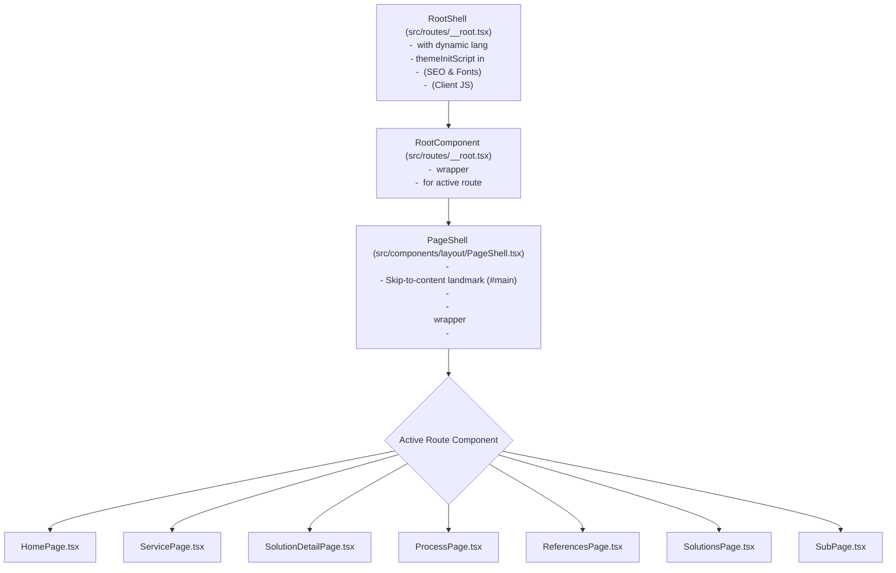

# Chapter 02: Architectural Foundations & System Topology

## 2.1 Fullstack Architecture Overview

**STP72 Foundation** is architected as an isomorphic, hybrid SSR/CSR application utilizing **TanStack Start** hosted on the **Nitro** server engine. It bridges server-side HTML streaming and client-side single-page application (SPA) interactivity through a unified routing and rendering pipeline.



---

## 2.2 Server & Framework Runtime Layer

### 1. Nitro Server Entrypoint ([`src/server.ts`](../src/server.ts))

The default server entry point is remapped in [`vite.config.ts:L13`](../vite.config.ts#L13) to point directly to `src/server.ts`. This acts as the outermost HTTP proxy around TanStack Start's bundled `@tanstack/react-start/server-entry`.

```typescript
// File: src/server.ts (lines 47-61)
export default {
  async fetch(request: Request, env: unknown, ctx: unknown) {
    try {
      const handler = await getServerEntry();
      const response = await handler.fetch(request, env, ctx);
      return await normalizeCatastrophicSsrResponse(response);
    } catch (error) {
      console.error(error);
      return new Response(renderErrorPage(), {
        status: 500,
        headers: { "content-type": "text/html; charset=utf-8" },
      });
    }
  },
};
```

### 2. TanStack Start Instance & Middlewares ([`src/start.ts`](../src/start.ts))

The framework instance is initialized with explicit global request middlewares:

1. **`errorMiddleware`**: Catches synchronous exceptions thrown during server function calls or SSR loader phases and returns an isolated 500 HTML response.
2. **`csrfMiddleware`**: Configured with `createCsrfMiddleware({ filter: (ctx) => ctx.handlerType === "serverFn" })` to strictly protect future server RPC actions against Cross-Site Request Forgery while permitting static SSR requests.

```typescript
// File: src/start.ts (lines 23-29)
const csrfMiddleware = createCsrfMiddleware({
  filter: (ctx) => ctx.handlerType === "serverFn",
});

export const startInstance = createStart(() => ({
  requestMiddleware: [errorMiddleware, csrfMiddleware],
}));
```

### 3. Router Factory & Query Context ([`src/router.tsx`](../src/router.tsx))

To ensure request isolation during SSR and prevent shared server state leaks across concurrent users, `getRouter()` instantiates a fresh `QueryClient` per request lifecycle.

```typescript
// File: src/router.tsx (lines 5-16)
export const getRouter = () => {
  const queryClient = new QueryClient();

  const router = createRouter({
    routeTree,
    context: { queryClient },
    scrollRestoration: true,
    defaultPreloadStaleTime: 0,
  });

  return router;
};
```

---

## 2.3 Request-to-Render Lifecycle

The execution lifecycle transitions through distinct server-side and client-side stages:



---

## 2.4 Component Tree & Layout Topology

The component hierarchy separates document-level shell mechanics from page content:



### Layout Responsibilities

| Component           | Responsibility                                                                                                                                                                                                                                                                             | Source Link                                                                                        |
| :------------------ | :----------------------------------------------------------------------------------------------------------------------------------------------------------------------------------------------------------------------------------------------------------------------------------------- | :------------------------------------------------------------------------------------------------- |
| **`RootShell`**     | Generates the outer `<html>`, `<head>`, and `<body>` tags. Extracts language from the first URL path segment (`/hu/...` $\rightarrow$ `lang="hu"`) to prevent hydration mismatches. Injects [`themeInitScript`](../src/lib/theme.ts#L36-L46).                                              | [`src/routes/__root.tsx:L116-136`](../src/routes/__root.tsx#L116-L136)                             |
| **`RootComponent`** | Wraps the application inside `<QueryClientProvider client={queryClient}>` and renders the top-level `<Outlet />`.                                                                                                                                                                          | [`src/routes/__root.tsx:L138-147`](../src/routes/__root.tsx#L138-L147)                             |
| **`PageShell`**     | Provides client-side [`ThemeProvider`](../src/components/theme/ThemeProvider.tsx#L27-L44), renders the accessible skip-to-content anchor, mounts [`SiteHeader`](../src/components/layout/SiteHeader.tsx), `<main id="main">`, and [`SiteFooter`](../src/components/layout/SiteFooter.tsx). | [`src/components/layout/PageShell.tsx:L20-43`](../src/components/layout/PageShell.tsx#L20-L43)     |
| **`SiteHeader`**    | Sticky 48px/56px enterprise navigation bar. Controls primary links, supporting dropdown ("More"), theme toggle, and mobile responsive sheet drawer.                                                                                                                                        | [`src/components/layout/SiteHeader.tsx:L38-258`](../src/components/layout/SiteHeader.tsx#L38-L258) |
| **`SiteFooter`**    | Multi-column categorical navigation footer, corporate copyright notices, and public code repository links.                                                                                                                                                                                 | [`src/components/layout/SiteFooter.tsx:L19-94`](../src/components/layout/SiteFooter.tsx#L19-L94)   |

---

## 2.5 Error Boundaries & SSR Fallback Architecture

The system implements a triple-layer defensive boundary against rendering failures:

1. **Catastrophic SSR Error Catchment** ([`src/server.ts`](../src/server.ts#L23-L36)): Captures unhandled Nitro exceptions and renders clean HTML via [`renderErrorPage()`](../src/lib/error-page.ts).
2. **TanStack Root `ErrorComponent`** ([`src/routes/__root.tsx`](../src/routes/__root.tsx#L43-L79)): Traps client-side rendering exceptions, notifies logging hooks via [`reportLovableError`](../src/lib/lovable-error-reporting.ts), and offers interactive `Try again` (cache invalidation) and `Go home` recovery actions.
3. **TanStack Root `NotFoundComponent`** ([`src/routes/__root.tsx`](../src/routes/__root.tsx#L21-L41)): Displays a styled 404 page for non-existent routes or invalid slug parameters without breaking layout state.
