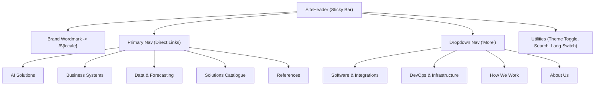

# Chapter 03: Routing, Localization & Invariant Navigation

## 3.1 The Invariant Key Routing Pattern

Traditional internationalization (i18n) architectures often suffer from two major flaws:

1. **Coupled URL Strings**: Components hardcode localized strings (`<Link to="/hu/rolunk">`), making refactoring brittle and multi-language routing error-prone.
2. **Context-Loss on Language Switching**: Switching languages on a nested subpage (e.g. `/hu/ai-megoldasok/vallalati-tudas-ai`) often drops the user back to the foreign homepage (`/en`) because the router cannot compute the translation counterpart of the current path segment.

**STP72 Foundation** solves this with an **Invariant Conceptual Key Architecture**:

```mermaid
flowchart LR
    subgraph ConceptualDomain ["Canonical Domain Model (Immutable Keys)"]
        Key["Key: 'company-knowledge-ai'\nParent: 'ai-solutions'"]
    end

    subgraph HU ["Hungarian Locale (/hu)"]
        SlugHU["/hu/ai-megoldasok/vallalati-tudas-ai"]
    end

    subgraph EN ["English Locale (/en)"]
        SlugEN["/en/ai-solutions/company-knowledge-ai"]
    end

    Key -->|solutionPath(key, 'hu')| SlugHU
    Key -->|solutionPath(key, 'en')| SlugEN

    SlugHU -->|solutionKeyFromSlugs('hu', 'ai-megoldasok', 'vallalati-tudas-ai')| Key
    SlugEN -->|solutionKeyFromSlugs('en', 'ai-solutions', 'company-knowledge-ai')| Key
```

Every page and solution has a single, immutable conceptual identifier defined in [`src/config/routes.ts`](../src/config/routes.ts) and [`src/config/solutions.ts`](../src/config/solutions.ts). Localized URL slugs exist only as data properties in translation lookup tables.

---

## 3.2 File-Based Route Tree

The application directory structure inside `src/routes/` defines the URL hierarchy:

```
src/routes/
├── __root.tsx                 # Root layout shell (HTML, Head, QueryClient)
├── index.tsx                  # Root redirect (/) -> (/$locale)
└── $locale/
    ├── index.tsx              # Home route (/{locale})
    ├── $slug.index.tsx        # Top-level destination routes (/{locale}/{slug})
    └── $slug.$child.tsx       # Nested solution routes (/{locale}/{family-slug}/{solution-slug})
```

### Route Table & URL Mapping

| Route File                                                           | URL Pattern             | Example URL (HU)                          | Example URL (EN)                         | Description                                                               |
| :------------------------------------------------------------------- | :---------------------- | :---------------------------------------- | :--------------------------------------- | :------------------------------------------------------------------------ |
| [`index.tsx`](../src/routes/index.tsx)                               | `/`                     | `/`                                       | `/`                                      | Immediate HTTP redirect to `/$locale` with `DEFAULT_LOCALE` (`hu`).       |
| [`$locale/index.tsx`](../src/routes/$locale/index.tsx)               | `/$locale`              | `/hu`                                     | `/en`                                    | Homepage with hero, capability matrix, forecast chart, and references.    |
| [`$locale/$slug.index.tsx`](../src/routes/$locale/$slug.index.tsx)   | `/$locale/$slug`        | `/hu/ai-megoldasok`<br>`/hu/referenciak`  | `/en/ai-solutions`<br>`/en/references`   | Flagship service hubs, catalogue overview, process, and supporting pages. |
| [`$locale/$slug.$child.tsx`](../src/routes/$locale/$slug.$child.tsx) | `/$locale/$slug/$child` | `/hu/keszlet-es-wms`<br>`/hu/elorejelzes` | `/en/inventory-wms`<br>`/en/forecasting` | Nested solution detail pages (13 distinct technical solutions).           |

---

## 3.3 Deep Dive into Slug Resolution & Validation

### 1. Conceptual Page Keys ([`src/config/routes.ts`](../src/config/routes.ts#L12-L56))

```typescript
// File: src/config/routes.ts (lines 12-26)
export const PAGE_KEYS = [
  "home",
  "ai-solutions",
  "business-systems",
  "data-forecasting",
  "software-integrations",
  "devops-infrastructure",
  "solutions",
  "references",
  "how-we-work",
  "about",
  "contact",
] as const;

export type PageKey = (typeof PAGE_KEYS)[number];
```

The mapping between conceptual page keys and localized path segments is managed by `routeSlugs`:

```typescript
// File: src/config/routes.ts (lines 34-45)
export const routeSlugs: Record<SubPageKey, Record<Locale, string>> = {
  "ai-solutions": { hu: "ai-megoldasok", en: "ai-solutions" },
  "business-systems": { hu: "uzleti-rendszerek", en: "business-systems" },
  "data-forecasting": { hu: "adat-es-elorejelzes", en: "data-forecasting" },
  "software-integrations": { hu: "szoftver-es-integraciok", en: "software-integrations" },
  "devops-infrastructure": { hu: "devops-infrastruktura", en: "devops-infrastructure" },
  solutions: { hu: "megoldasok", en: "solutions" },
  references: { hu: "referenciak", en: "references" },
  "how-we-work": { hu: "hogyan-dolgozunk", en: "how-we-work" },
  about: { hu: "rolunk", en: "about" },
  contact: { hu: "kapcsolat", en: "contact" },
};
```

### 2. Nested Solution Slugs ([`src/config/solutions.ts`](../src/config/solutions.ts#L13-L98))

The 13 sub-solutions belong to three parent flagship families (`ai`, `business`, `data`):

```typescript
// File: src/config/solutions.ts (lines 42-52)
export const solutionsByFamily: Record<SolutionFamilyKey, SolutionKey[]> = {
  ai: ["company-knowledge-ai", "ai-automation", "ai-agents", "ai-integration"],
  business: [
    "inventory-wms",
    "erp-operations",
    "production",
    "rental-asset-management",
    "custom-business-system",
  ],
  data: ["analytics", "forecasting", "what-if-planning", "ai-analyst"],
};
```

The resolution function [`solutionKeyFromSlugs`](../src/config/solutions.ts#L88-L98) verifies both that the child slug belongs to the solution AND that the parent slug in the URL corresponds to the family owner:

```typescript
// File: src/config/solutions.ts (lines 88-98)
export function solutionKeyFromSlugs(
  locale: Locale,
  parentSlug: string,
  childSlug: string,
): SolutionKey | undefined {
  return SOLUTION_KEYS.find(
    (key) =>
      solutionSlugs[key][locale] === childSlug &&
      routeSlugs[parentPageOfSolution(key)][locale] === parentSlug,
  );
}
```

---

## 3.4 Strict 404 Boundary Enforcements

To prevent URL pollution, SEO duplicate content penalties, and broken UI rendering, every route file executes rigorous validation in its `beforeLoad` hook:

```typescript
// File: src/routes/$locale/$slug.$child.tsx (lines 16-20)
export const Route = createFileRoute("/$locale/$slug/$child")({
  beforeLoad: ({ params }) => {
    if (!isLocale(params.locale)) throw notFound();
    if (!solutionKeyFromSlugs(params.locale, params.slug, params.child)) throw notFound();
  },
  // ...
});
```

### Validation Invariants

1. **Unknown Locales**: Accessing `/fr/ai-solutions` immediately throws `notFound()`.
2. **Language Mismatch**: Accessing `/hu/ai-solutions` (English slug under Hungarian prefix) throws `notFound()`.
3. **Invalid Hierarchy**: Accessing `/hu/uzleti-rendszerek/vallalati-tudas-ai` (AI solution under Business Systems parent) throws `notFound()`.

---

## 3.5 Navigation Topology & Information Architecture

The navigation bar in [`src/components/layout/SiteHeader.tsx`](../src/components/layout/SiteHeader.tsx) divides routes into primary flagship links and secondary capabilities:



### Component-Level Routing Abstraction ([`src/components/nav/PageLink.tsx`](../src/components/nav/PageLink.tsx))

To eliminate raw strings across UI code, developers use [`PageLink`](../src/components/nav/PageLink.tsx#L23-L45) and [`SolutionLink`](../src/components/nav/PageLink.tsx#L54-L68):

```tsx
// Navigating to a top-level page
<PageLink page="references" locale={locale}>
  {c.pages.references.navLabel}
</PageLink>

// Navigating to a nested solution
<SolutionLink solution="forecasting" locale={locale}>
  {d.navLabel}
</SolutionLink>
```
