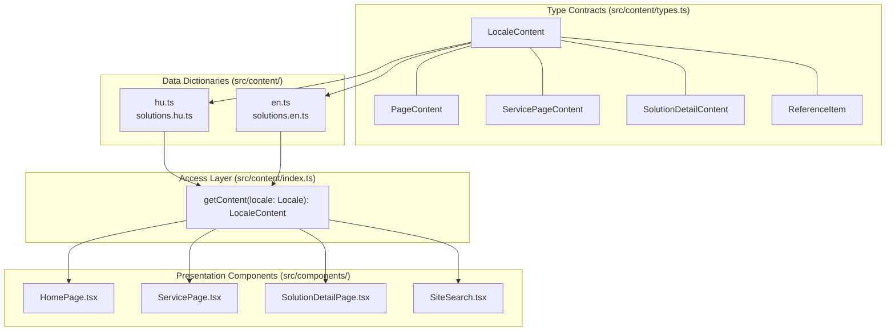
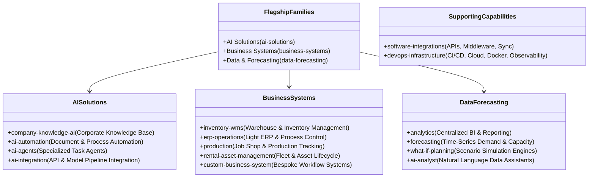

# Chapter 04: Content Engine & Type Safety Contracts

## 4.1 The Zero-Inline Copy Architecture

A foundational rule of the STP72 codebase is the **Zero-Inline Copy Policy**:

> **Architecture Rule**: No user-visible string, paragraph, label, heading, placeholder, or SEO description may be written directly within a React JSX component. All textual content must reside in strongly typed content modules ([`src/content/`](../src/content/)).



---

## 4.2 Core TypeScript Schema Contracts ([`src/content/types.ts`](../src/content/types.ts))

The schema definitions in `types.ts` establish rigorous contracts across all textual content:

### 1. Root Locale Content ([`src/content/types.ts:L223-389`](../src/content/types.ts#L223-L389))

```typescript
export type LocaleContent = {
  meta: { home: SeoContent };
  pages: Record<SubPageKey, PageContent>;
  servicePages: Partial<Record<SubPageKey, ServicePageContent>>;
  referencesPage: ReferencesPageContent;
  processPage: ProcessPageContent;
  solutionsPage: SolutionsPageContent;
  solutionFamilies: Record<SolutionFamilyKey, SolutionFamilyContent>;
  solutionDetails: Record<SolutionKey, SolutionDetailContent>;
  common: CommonLabels;
  nav: NavItem[];
  home: HomePageContent;
  footer: FooterContent;
  services: ServiceContent[];
};
```

### 2. Solution Detail Contract ([`src/content/types.ts:L148-176`](../src/content/types.ts#L148-L176))

Each of the 13 nested sub-solution pages implements an identical, highly structured schema:

```typescript
export type SolutionDetailContent = {
  navLabel: string; // Short navigation title
  title: string; // H1 Main Title
  eyebrow: string; // Business-positioning eyebrow
  summary: [string, string]; // Exactly two introductory paragraphs
  catalogSummary: string; // Overview blurb for parent catalogue
  catalogPoints: [string, string, string]; // Exactly three high-level bullets
  situations: string[]; // Concrete operational problem triggers (3-5)
  capabilities: string[]; // Distinct solution features (4-6)
  inputs: string[]; // Source data, interfaces, and prerequisites
  start: StageBlock[]; // Project kick-off sequence (3-4 stages)
  evaluation: string[]; // Validation logic & accuracy criteria
  evidenceKeys: string[]; // Foreign keys into reference items
  technical: string[]; // Possible implementation technologies
  seo: SeoContent; // Meta title, description, OG tags
};
```

### 3. Engineering Evidence Contract ([`src/content/types.ts:L51-64`](../src/content/types.ts#L51-L64))

Engineering references are classified strictly by technical maturity:

```typescript
export type ReferenceStatus = "demonstrator" | "reference-architecture" | "prototype";

export type ReferenceItem = {
  key: string; // Stable identifier
  name: string; // Project title
  summary: string; // One-paragraph technical summary
  status: ReferenceStatus; // Verifiable maturity level
  url?: string; // Public GitHub repository link
  evidence?: string[]; // What is specifically visible in the repo
};
```

---

## 4.3 Catalogue Taxonomy Matrix

The STP72 technical catalogue organizes 13 sub-solutions into 3 flagship families, supported by 2 foundational engineering capabilities:



---

## 4.4 Modular Content Organization

To maintain maintainability across large textual datasets (tens of thousands of lines), the content files are organized modularly:

```
src/content/
├── en.ts                <-- Primary English dictionary (Root, Services, Process, References)
├── hu.ts                <-- Primary Hungarian dictionary
├── solutions.en.ts      <-- English solution family & detail objects (imported into en.ts)
├── solutions.hu.ts      <-- Hungarian solution family & detail objects (imported into hu.ts)
└── index.ts             <-- getContent(locale) entry point
```

### Content Retrieval ([`src/content/index.ts`](../src/content/index.ts#L1-L12))

```typescript
import { DEFAULT_LOCALE, type Locale } from "@/config/site";
import { en } from "./en";
import { hu } from "./hu";
import type { LocaleContent } from "./types";

export const content: Record<Locale, LocaleContent> = { hu, en };

export const getContent = (locale: Locale): LocaleContent =>
  content[locale] ?? content[DEFAULT_LOCALE];
```

---

## 4.5 Engineering Evidence & Verifiable Reference Model

The platform enforces that no project claims are presented without verifiable status classifications:

| Status                     | Code Label               | Meaning & Evidence Boundary                                                                                            |
| :------------------------- | :----------------------- | :--------------------------------------------------------------------------------------------------------------------- |
| **Demonstrator**           | `demonstrator`           | Functional end-to-end working system demonstrating architectural viability. Verified against live public repositories. |
| **Reference Architecture** | `reference-architecture` | Verified structural design patterns, infrastructure definitions, and integration blueprints.                           |
| **Prototype**              | `prototype`              | Experimental validation of core algorithms, ML model pipelines, or complex business logic.                             |

This model guarantees that every claim on the platform is defensible, credible, and grounded in working software artifacts.
