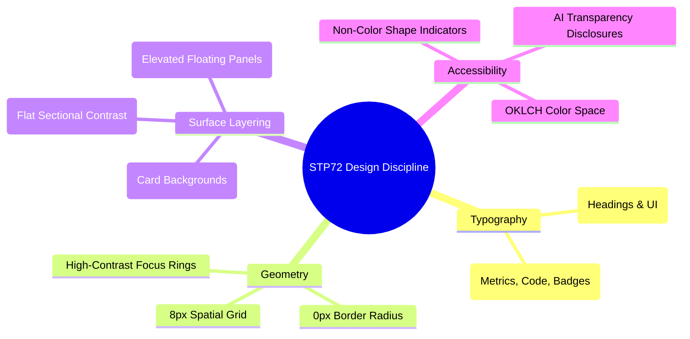
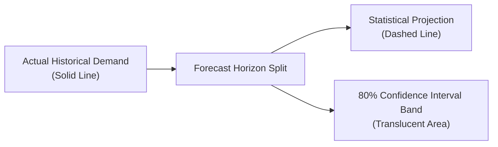

# Chapter 05: Design System, Tokens & UI Architecture

## 5.1 Design System Philosophy: The IBM Carbon Discipline

The visual and interaction language of STP72 Foundation is inspired by enterprise engineering systems such as **IBM Carbon**. It deliberately avoids decorative gradients, soft rounded corners, and excessive drop shadows, adhering instead to a rigorous set of constraints:



---

## 5.2 Tailwind CSS v4 Engine & OKLCH Token Geometry

The styling foundation is configured via **Tailwind CSS v4** in [`src/styles.css`](../src/styles.css). All color values use perceptual `oklch(...)` notation, ensuring uniform lightness and chroma scaling across light and dark modes.

### Theme Token Mapping ([`src/styles.css:L17-91`](../src/styles.css#L17-L91))

```css
@theme inline {
  --font-sans: "IBM Plex Sans", ui-sans-serif, system-ui, sans-serif;
  --font-mono: "IBM Plex Mono", ui-monospace, SFMono-Regular, monospace;

  /* Layered neutral surfaces */
  --color-layer-01: var(--layer-01);
  --color-layer-02: var(--layer-02);
  --color-layer-03: var(--layer-03);

  /* Semantic status roles */
  --color-support-error: var(--support-error);
  --color-support-warning: var(--support-warning);
  --color-support-success: var(--support-success);
  --color-support-info: var(--support-info);

  /* Rectangular geometry across the system */
  --radius-sm: 0px;
  --radius-md: 0px;
  --radius-lg: 0px;
  --radius-xl: 2px;
}
```

### Light vs Dark Surface Palette

| Variable       | Token Role          | Light Mode (OKLCH)                   | Dark Mode (OKLCH)                       |
| :------------- | :------------------ | :----------------------------------- | :-------------------------------------- |
| `--background` | Base Canvas         | `oklch(1 0 0)` (Pure White)          | `oklch(0.14 0.005 260)` (Deep Charcoal) |
| `--layer-01`   | Section Surface     | `oklch(0.968 0.002 260)`             | `oklch(0.18 0.005 260)`                 |
| `--layer-02`   | Tile / Card Surface | `oklch(0.938 0.003 260)`             | `oklch(0.22 0.005 260)`                 |
| `--layer-03`   | Modal / Overlay     | `oklch(0.89 0.004 260)`              | `oklch(0.27 0.005 260)`                 |
| `--foreground` | Primary Typography  | `oklch(0.19 0.005 260)`              | `oklch(0.96 0.002 260)`                 |
| `--accent`     | Controlled Accent   | `oklch(0.48 0.22 260)` (Cobalt Blue) | `oklch(0.68 0.18 255)` (Electric Blue)  |

---

## 5.3 Custom Design System Primitives ([`src/components/ds/`](../src/components/ds/))

### 1. AI Transparency Disclosure ([`AILabel.tsx`](../src/components/ds/AILabel.tsx))

Whenever an AI-driven capability or model artifact is displayed, the [`AILabel`](../src/components/ds/AILabel.tsx#L32-L93) component provides interactive, accessible disclosure:

```tsx
// File: src/components/ds/AILabel.tsx
<AILabel
  locale={locale}
  whatItDid="Summarised internal documentation from 3 knowledge base articles"
  whatItUsed="Indexed markdown files and semantic embeddings (Gemini Flash)"
  whatToVerify="Cross-check invoice reference IDs and client account totals"
/>
```

- **UI Element**: Renders a discrete mono badge (`[AI]`) with an interactive popover detailing:
  1. Exactly what task the model performed.
  2. The input data and context provided to the model.
  3. The mandatory human verification steps required before acting on the output.

### 2. Multi-Modal Status Indicator ([`StatusIndicator.tsx`](../src/components/ds/StatusIndicator.tsx))

To comply with WCAG 2.1 Color-Blindness standards, status indicators pair distinct colors with geometric symbols:

```typescript
// File: src/components/ds/StatusIndicator.tsx (lines 14-19)
const GLYPHS: Record<StatusType, string> = {
  active: "●", // Filled circle (Success / Live)
  planned: "▲", // Triangle (In Development)
  prototype: "■", // Square (Experimental)
  deprecated: "◆", // Diamond (Legacy)
};
```

### 3. Forecast Time-Series Chart ([`ForecastChart.tsx`](../src/components/ds/ForecastChart.tsx))

Visualizes statistical demand and capacity projections using Recharts:



- **Responsive SVG**: Dynamically adapts between mobile (400px) and desktop viewports.
- **Accessible Fallback**: Provides a structured `sr-only` table summary of data points for screen readers.

### 4. Service Architectural Flow ([`FlowDiagram.tsx`](../src/components/ds/FlowDiagram.tsx))

Renders multi-stage pipeline architectures (Input $\rightarrow$ Processing $\rightarrow$ Output) with tone indicators (`context`, `core`, `outcome`), ensuring visual scanning clarity across complex integrations.

---

## 5.4 Layout Scaffolding Components ([`src/components/layout/`](../src/components/layout/))

```
src/components/layout/
├── Container.tsx      <-- Max-width constrained containers (narrow, normal, wide)
├── Section.tsx        <-- Surface-layered semantic sections (<section>)
├── PageShell.tsx      <-- Top-level page wrapper with skip-link and ThemeProvider
├── SiteHeader.tsx     <-- Sticky enterprise header with responsive sheet
└── SiteFooter.tsx     <-- Structured multi-column navigation footer
```

### Grid & Section Discipline

Sections use alternating surface backgrounds (`background` vs `layer`) to create natural visual grouping without intrusive divider rules:

```tsx
// Example of structured Section composition
<Section surface="layer" spacing="md" aria-labelledby="situations-heading">
  <div className="grid gap-8 lg:grid-cols-12">
    <div className="lg:col-span-5">
      <SectionLabel>{c.pages[parent].navLabel}</SectionLabel>
      <DisplayHeading id="situations-heading" size="sm">
        {labels.situations}
      </DisplayHeading>
    </div>
    <div className="lg:col-span-6 lg:col-start-7">
      <RuleList items={d.situations} />
    </div>
  </div>
</Section>
```
