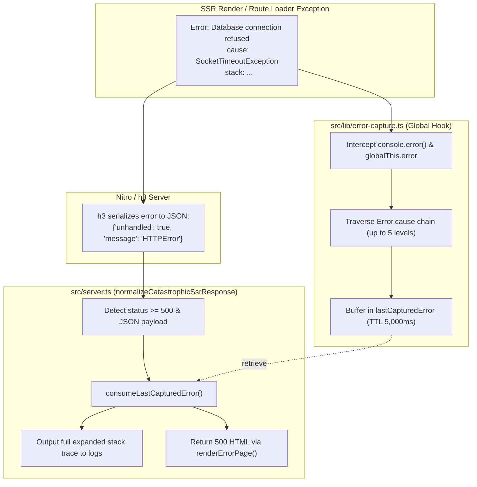
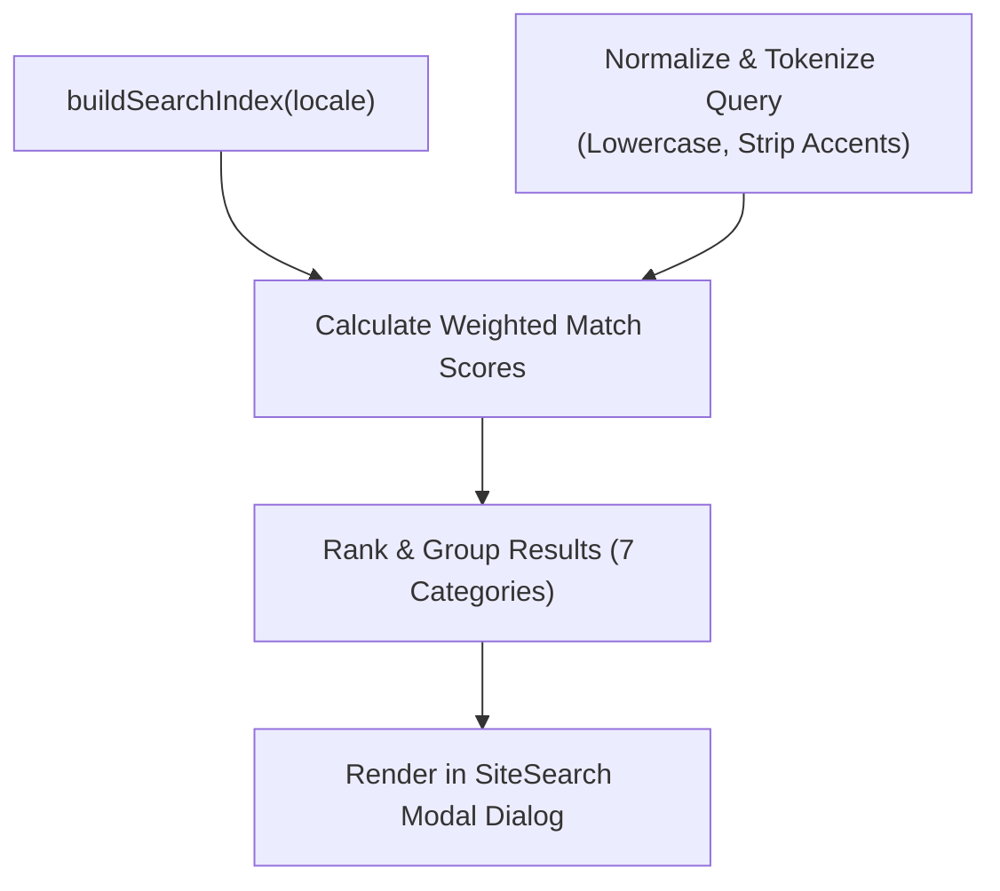
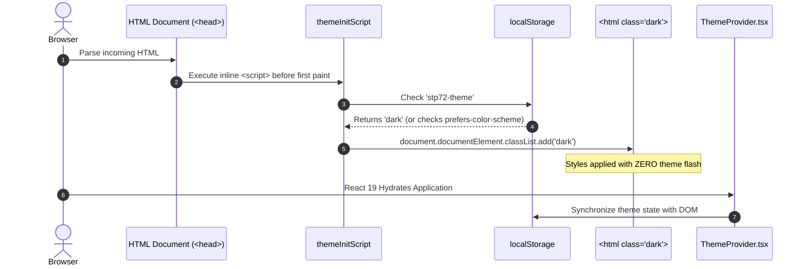

# Chapter 06: Core Runtime Subsystems

## 6.1 Hardened SSR Error Recovery & Cause-Chain Capture

In standard Nitro/h3 server runtimes, server-side exceptions that occur during nested SSR rendering or async route loaders are frequently caught by the framework's internal handler and converted into an opaque JSON response:

```json
{ "status": 500, "unhandled": true, "message": "HTTPError" }
```

When this occurs, standard `try / catch` blocks in outer fetch handlers fail to trigger, and critical debugging information (stack traces, nested error causes) is stripped from logs.



### 1. Cause-Chain Traversal ([`src/lib/error-capture.ts`](../src/lib/error-capture.ts#L18-L32))

The [`describeError`](../src/lib/error-capture.ts#L18) utility recursively traverses nested `cause` chains up to 5 levels deep:

```typescript
// File: src/lib/error-capture.ts (lines 18-32)
export function describeError(error: unknown): string {
  const parts: string[] = [];
  let current: unknown = error;
  for (let depth = 0; depth < CAUSE_DEPTH_LIMIT && current != null; depth++) {
    if (!(current instanceof Error)) {
      parts.push(typeof current === "string" ? current : safeStringify(current));
      break;
    }
    const label = depth === 0 ? "" : "caused by: ";
    const status = describeStatus(current);
    parts.push(`${label}${current.stack ?? `${current.name}: ${current.message}`}${status}`);
    current = current.cause;
  }
  return parts.join("\n").slice(0, DESCRIPTION_LENGTH_LIMIT);
}
```

### 2. Server Response Normalization ([`src/server.ts`](../src/server.ts#L23-L36))

The fetch wrapper intercepts swallowed 500 responses and replaces them with a user-friendly standalone HTML error page:

```typescript
// File: src/server.ts (lines 23-36)
async function normalizeCatastrophicSsrResponse(response: Response): Promise<Response> {
  if (response.status < 500) return response;
  const contentType = response.headers.get("content-type") ?? "";
  if (!contentType.includes("application/json")) return response;

  const body = await response.clone().text();
  if (!isH3SwallowedErrorBody(body)) return response;

  console.error(consumeLastCapturedError() ?? new Error(`h3 swallowed SSR error: ${body}`));
  return new Response(renderErrorPage(), {
    status: 500,
    headers: { "content-type": "text/html; charset=utf-8" },
  });
}
```

---

## 6.2 Client-Side In-Memory Search Indexer

The site features an instant, client-side fuzzy search engine ([`src/lib/search-index.ts`](../src/lib/search-index.ts)) paired with a modal dialog ([`src/components/search/SiteSearch.tsx`](../src/components/search/SiteSearch.tsx)).



### 1. Multi-Group Entry Extraction

The indexer compiles content into 7 distinct groups:

1. `page`: Top-level navigational routes.
2. `service`: High-level service offerings.
3. `solution`: Flagship solution families.
4. `solution-detail`: The 13 nested sub-solution pages.
5. `situation`: Operational problem statements.
6. `section`: Subsections within pages.
7. `reference`: Public engineering demonstrator projects.

### 2. Weighted Scoring Algorithm ([`src/lib/search-index.ts:L115-167`](../src/lib/search-index.ts#L115-L167))

$$ \text{Score} = \sum_{\text{token} \in \text{query}} \left( 10 \cdot \mathbb{I}_{\text{TitleMatch}}(\text{token}) + 2 \cdot \mathbb{I}_{\text{DescMatch}}(\text{token}) + \text{Bonus}_{\text{ExactPhrase}} \right) $$

```typescript
// File: src/lib/search-index.ts (lines 146-155)
let score = 0;
for (const token of tokens) {
  if (titleNorm.includes(token)) score += 10;
  if (descNorm.includes(token)) score += 2;
}
if (titleNorm.startsWith(normalizedQuery)) score += 20;
if (titleNorm.includes(normalizedQuery)) score += 15;
if (descNorm.includes(normalizedQuery)) score += 5;
```

---

## 6.3 Zero-FOUC Theme Hydration Engine

To avoid the Flash of Unstyled Content (FOUC) when loading in dark mode, theme resolution is divided into a **synchronous pre-render script** and a **React context provider**.



### 1. Head Injection Script ([`src/lib/theme.ts`](../src/lib/theme.ts#L36-L46))

```javascript
export const themeInitScript = `(function(){try{var t=localStorage.getItem("stp72-theme");var d=window.matchMedia("(prefers-color-scheme: dark)").matches;if(t==="dark"||(!t&&d)){document.documentElement.classList.add("dark");}else{document.documentElement.classList.remove("dark");}}catch(e){}})();`;
```

Injected into [`src/routes/__root.tsx:L126`](../src/routes/__root.tsx#L126) inside the document `<head>`:

```tsx
<head>
  <script dangerouslySetInnerHTML={{ __html: themeInitScript }} />
  <HeadContent />
</head>
```

---

## 6.4 Dynamic SEO & Hreflang Alternates Generator

Search engine optimization tags are programmatically generated via [`buildLocaleHead`](../src/lib/seo.ts#L28-L65).

### Automated Invariants

1. **Bidirectional Canonical & Alternate Mapping**: Every Hungarian page automatically generates cross-referenced `alternate` `hreflang` tags pointing to the exact English equivalent slug (and vice versa).
2. **`x-default` Fallback**: The default language version (`/hu`) is explicitly marked as `x-default`.
3. **OpenGraph & Twitter Cards**: Generates localized social metadata with appropriate `og:locale` (`hu_HU` vs `en_US`).

```typescript
// File: src/lib/seo.ts (lines 54-63)
const links: LinkTag[] = [
  { rel: "canonical", href: url },
  ...LOCALES.map((l) => ({
    rel: "alternate",
    hrefLang: l,
    href: pathFor(l),
  })),
  { rel: "alternate", hrefLang: "x-default", href: pathFor(DEFAULT_LOCALE) },
];
```
