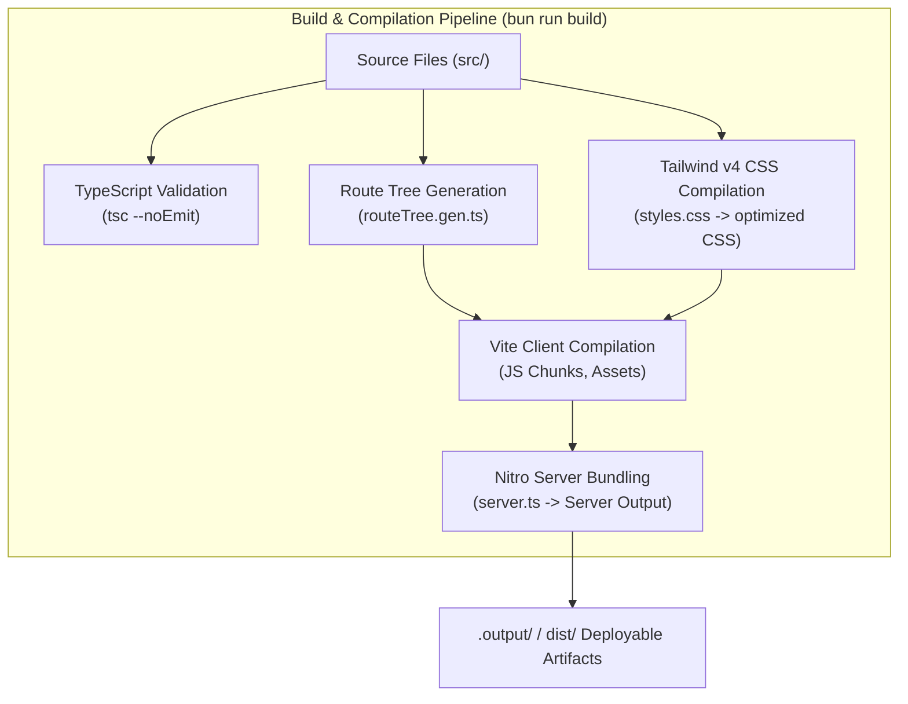
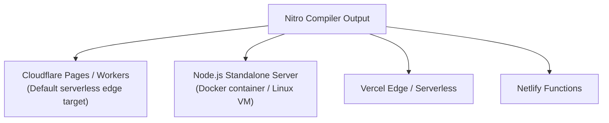

# Chapter 07: Operations, Build Pipeline & Deployment

## 7.1 Toolchain & Build Pipeline

The STP72 application uses **Vite 8**, **Bun / Node.js**, and **Nitro** for fast development iterations and production builds.



---

## 7.2 Configuration Manifests

### 1. Vite & TanStack Config ([`vite.config.ts`](file:///home/w7-loqker/w7-workspace/selfbase/@stp72.com/repos/STP72-company/vite.config.ts))
```typescript
import { defineConfig } from "@lovable.dev/vite-tanstack-config";

export default defineConfig({
  tanstackStart: {
    // Redirects TanStack Start's bundled server entry to our custom SSR error wrapper
    server: { entry: "server" },
  },
});
```

### 2. NPM Scripts & Overrides ([`package.json`](file:///home/w7-loqker/w7-workspace/selfbase/@stp72.com/repos/STP72-company/package.json))
```json
{
  "scripts": {
    "dev": "vite dev",
    "build": "vite build",
    "build:dev": "vite build --mode development",
    "preview": "vite preview",
    "lint": "eslint .",
    "format": "prettier --write ."
  },
  "overrides": {
    "rolldown": "1.2.1"
  }
}
```

---

## 7.3 Deployment Target Architecture

Nitro provides seamless compilation to multiple serverless and containerized deployment targets:



### Deployment Commands

#### Target: Cloudflare Pages / Workers (Edge SSR)
```bash
# Default build target configured in preset
bun run build
# Deploy output from .output/public and .output/server
wrangler pages deploy .output/public
```

#### Target: Docker / Standalone Node.js Container
To run in a containerized environment:
```dockerfile
FROM oven/bun:1.2-slim as builder
WORKDIR /app
COPY package.json bun.lock ./
RUN bun install --frozen-lockfile
COPY . .
RUN bun run build

FROM oven/bun:1.2-slim
WORKDIR /app
COPY --from=builder /app/.output ./.output
ENV PORT=3000
ENV NODE_ENV=production
EXPOSE 3000
CMD ["bun", "run", ".output/server/index.mjs"]
```

---

## 7.4 Developer & Operational Runbooks

### Runbook A: Adding a New Top-Level Page
1. **Declare Conceptual Key**: Add the page name to `PAGE_KEYS` in [`src/config/routes.ts`](file:///home/w7-loqker/w7-workspace/selfbase/@stp72.com/repos/STP72-company/src/config/routes.ts#L12-L24).
2. **Define Localized Slugs**: Register both Hungarian and English slugs in `routeSlugs` in [`src/config/routes.ts`](file:///home/w7-loqker/w7-workspace/selfbase/@stp72.com/repos/STP72-company/src/config/routes.ts#L34-L45).
3. **Populate Content**:
   - Add copy in [`src/content/hu.ts`](file:///home/w7-loqker/w7-workspace/selfbase/@stp72.com/repos/STP72-company/src/content/hu.ts) under `pages[newKey]`.
   - Add copy in [`src/content/en.ts`](file:///home/w7-loqker/w7-workspace/selfbase/@stp72.com/repos/STP72-company/src/content/en.ts) under `pages[newKey]`.
4. **Assign Navigation Category**: Include the key in `navPrimary` or `navMore` in [`src/config/routes.ts`](file:///home/w7-loqker/w7-workspace/selfbase/@stp72.com/repos/STP72-company/src/config/routes.ts#L66-L80).
5. **Verify Routing**: Start dev server (`bun run dev`) and test both `/hu/{slug}` and `/en/{slug}`.

### Runbook B: Adding a New Sub-Solution Detail Page
1. **Register Solution Key**: Add key to `SOLUTION_KEYS` in [`src/config/solutions.ts`](file:///home/w7-loqker/w7-workspace/selfbase/@stp72.com/repos/STP72-company/src/config/solutions.ts#L23-L37).
2. **Assign to Family**: Add key to `solutionsByFamily[family]` in [`src/config/solutions.ts`](file:///home/w7-loqker/w7-workspace/selfbase/@stp72.com/repos/STP72-company/src/config/solutions.ts#L42-L52).
3. **Define Slugs**: Add slugs to `solutionSlugs` in [`src/config/solutions.ts`](file:///home/w7-loqker/w7-workspace/selfbase/@stp72.com/repos/STP72-company/src/config/solutions.ts#L61-L75).
4. **Write Structured Content**: Add full 13-section object in [`src/content/solutions.hu.ts`](file:///home/w7-loqker/w7-workspace/selfbase/@stp72.com/repos/STP72-company/src/content/solutions.hu.ts) and [`src/content/solutions.en.ts`](file:///home/w7-loqker/w7-workspace/selfbase/@stp72.com/repos/STP72-company/src/content/solutions.en.ts).
5. **Verify Indexing & Search**: Open search modal (`Ctrl+K` or search button) and verify the new solution appears with weighted score bonuses.

### Runbook C: Quality Assurance Verification
```bash
# 1. Type-check codebase
bun x tsc --noEmit

# 2. Lint source files
bun run lint

# 3. Format codebase
bun run format

# 4. Production build test
bun run build
```
