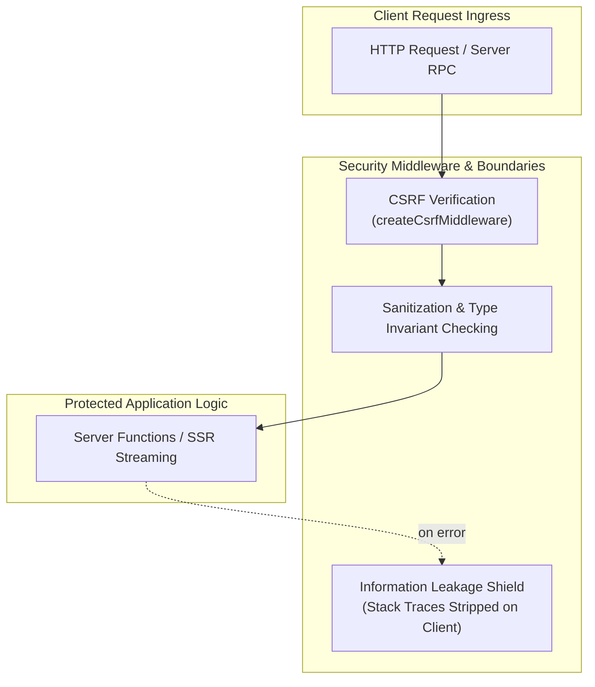
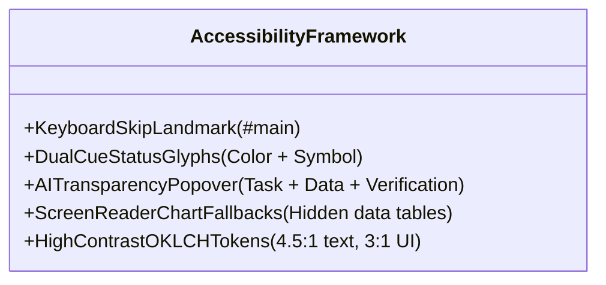

# Chapter 08: Security, Performance & Quality Assurance

## 8.1 Security Architecture & Protection Boundaries



### 1. Cross-Site Request Forgery (CSRF) Middleware ([`src/start.ts`](../src/start.ts#L23-L25))

Server function invocations (`serverFn`) are safeguarded against cross-origin abuse via origin header validation:

```typescript
// File: src/start.ts (lines 23-25)
const csrfMiddleware = createCsrfMiddleware({
  filter: (ctx) => ctx.handlerType === "serverFn",
});
```

### 2. Information Leakage Prevention ([`src/server.ts`](../src/server.ts#L32-L36))

Stack traces, internal server file paths, and environment secrets are strictly intercepted on the server. When an exception occurs, a generic, styled fallback response is returned to the user ([`renderErrorPage()`](../src/lib/error-page.ts)), while the full stack is output exclusively to internal server stdout/stderr.

---

## 8.2 Performance Engineering

### 1. Zero-Runtime Translation Overhead

Unlike libraries that load JSON files over the network (e.g. `react-i18next`), STP72 compiles Hungarian and English dictionaries directly into the static application bundle. Content retrieval via [`getContent(locale)`](../src/content/index.ts#L8-L9) executes with $O(1)$ memory pointer lookup without asynchronous network fetch delays.

### 2. Font Loading & Core Web Vitals (LCP / CLS)

To achieve sub-second Largest Contentful Paint (LCP) and zero Cumulative Layout Shift (CLS), typography resources are preconnected in [`src/routes/__root.tsx`](../src/routes/__root.tsx#L99-L105):

```tsx
// File: src/routes/__root.tsx (lines 99-105)
{ rel: "preconnect", href: "https://fonts.googleapis.com" },
{ rel: "preconnect", href: "https://fonts.gstatic.com", crossOrigin: "anonymous" },
{
  rel: "stylesheet",
  href: "https://fonts.googleapis.com/css2?family=IBM+Plex+Sans:wght@300;400;500;600&family=IBM+Plex+Mono:wght@400;500&display=swap",
}
```

### 3. Route Splitting & Preload Management

TanStack Start automatically code-splits routes by file. The router is configured with `defaultPreloadStaleTime: 0` in [`src/router.tsx:L12`](../src/router.tsx#L12), ensuring immediate asset preloading on hover over [`PageLink`](../src/components/nav/PageLink.tsx) components.

---

## 8.3 Accessibility (WCAG 2.1 AA Compliance)



### Accessibility Checkpoints

1. **Keyboard Skip Link**: Built directly into [`PageShell.tsx:L27-31`](../src/components/layout/PageShell.tsx#L27-L31), allowing keyboard users to bypass header navigation and jump straight to the `<main id="main">` landmark.
2. **Dual-Channel Status Glyphs**: The [`StatusIndicator`](../src/components/ds/StatusIndicator.tsx) uses both color and distinct unicode characters (`●`, `▲`, `■`, `◆`) to ensure clarity for color-blind users.
3. **Data Visualization Screen-Reader Fallbacks**: The [`ForecastChart`](../src/components/ds/ForecastChart.tsx) embeds an accessible summary table for assistive technologies alongside the graphical Recharts SVG.
4. **AI Transparency Accountability**: The [`AILabel`](../src/components/ds/AILabel.tsx) provides full disclosure of model operations, source context, and verification responsibilities.
