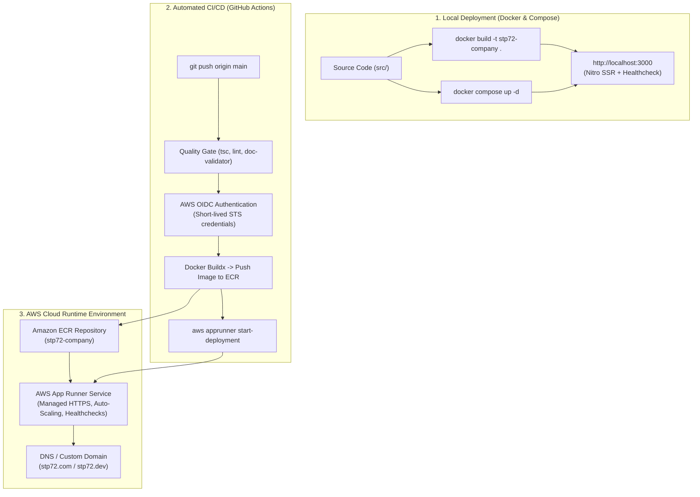
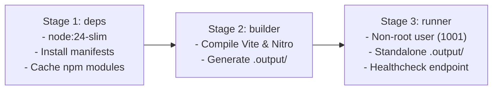

# Chapter 10: Containerization, Local Deployment & AWS Cloud Architecture

## 10.1 Architecture Topology & Deployment Overview

**STP72 Foundation** is packaged as an immutable, production-hardened container capable of running identically on local workstations, staging servers, and AWS cloud infrastructure.



---

## 10.2 Local Container Deployment Guide

### Prerequisites
- [Docker Engine](https://docs.docker.com/engine/) (version 24.0+)
- [Docker Compose](https://docs.docker.com/compose/) (version 2.20+)

### Method 1: Using Docker Compose (Recommended)

To start the full application container in detached mode:

```bash
# Build and start the container
docker compose up -d

# View real-time application logs
docker compose logs -f

# Check container health status
docker compose ps

# Stop the container
docker compose down
```

Once running, access the application at **[http://localhost:3000](http://localhost:3000)** (which forwards to `/hu` by default).

### Method 2: Using the Standalone Docker CLI

```bash
# 1. Build the production image
docker build -t stp72-company:latest .

# 2. Run container with port mapping and environment variables
docker run -d \
  --name stp72-company \
  -p 3000:3000 \
  -e PORT=3000 \
  -e NODE_ENV=production \
  --restart unless-stopped \
  stp72-company:latest

# 3. Check logs
docker logs -f stp72-company
```

---

## 10.3 Multi-Stage Dockerfile Anatomy

The [`Dockerfile`](file:///home/w7-loqker/w7-workspace/selfbase/@stp72.com/repos/STP72-company/Dockerfile) uses a 3-stage architecture designed for security, minimal image size (~140MB), and build-cache optimization:



1. **Stage 1 (`deps`)**: Caches dependencies from `package.json` before source code is copied, preventing repeated `npm install` runs on code changes.
2. **Stage 2 (`builder`)**: Builds the TanStack Start and Nitro production artifacts into the `.output/` bundle.
3. **Stage 3 (`runner`)**: Strips all build tools, devDependencies, and source code. Executes under an unprivileged `nodejs` system account (`uid: 1001`, `gid: 1001`) with an integrated HTTP healthcheck.

---

## 10.4 AWS Cloud Architecture & Infrastructure Setup

### Compute Target: AWS App Runner
**AWS App Runner** is chosen as the primary compute target because it provides:
- Fully managed container execution without Kubernetes or VPC networking overhead.
- Automatic SSL/TLS certificate issuance and renewal.
- Automatic horizontal scaling based on concurrent HTTP requests.
- Direct integration with Amazon Elastic Container Registry (ECR).

---

### Step-by-Step AWS Setup Guide

#### 1. Create Amazon ECR Private Repository
```bash
aws ecr create-repository \
  --repository-name stp72-company \
  --image-scanning-configuration scanOnPush=true \
  --region eu-central-1
```

#### 2. Configure GitHub Actions OIDC Role (No Static Access Keys)

Create an IAM Trust Policy file `github-oidc-trust.json`:

```json
{
  "Version": "2012-10-17",
  "Statement": [
    {
      "Effect": "Allow",
      "Principal": {
        "Federated": "arn:aws:iam::<ACCOUNT_ID>:oidc-provider/token.actions.githubusercontent.com"
      },
      "Action": "sts:AssumeRoleWithWebIdentity",
      "Condition": {
        "StringEquals": {
          "token.actions.githubusercontent.com:aud": "sts.amazonaws.com"
        },
        "StringLike": {
          "token.actions.githubusercontent.com:sub": "repo:STP72-dev/STP72-company:*"
        }
      }
    }
  ]
}
```

Create the IAM role and attach ECR and App Runner deployment permissions:

```bash
# Create the IAM role
aws iam create-role \
  --role-name GitHubActions-STP72-Deploy \
  --assume-role-policy-document file://github-oidc-trust.json

# Attach ECR and App Runner policies
aws iam attach-role-policy \
  --role-name GitHubActions-STP72-Deploy \
  --policy-arn arn:aws:iam::aws:policy/AmazonEC2ContainerRegistryPowerUser

aws iam attach-role-policy \
  --role-name GitHubActions-STP72-Deploy \
  --policy-arn arn:aws:iam::aws:policy/AWSAppRunnerFullAccess
```

#### 3. Create AWS App Runner Service

In the AWS Console (or via CLI):
1. Navigate to **AWS App Runner** -> **Create service**.
2. Select **Container registry** -> **Amazon ECR**.
3. Choose the `stp72-company` repository and select image tag `latest`.
4. Deployment settings: Select **Automatic** or **Manual** (the GitHub Actions workflow triggers deployment explicitly).
5. Service configuration:
   - **Port**: `3000`
   - **vCPU / Memory**: `1 vCPU / 2 GB RAM` (or `0.25 vCPU / 0.5 GB` for base traffic)
   - **Health check path**: `/hu` (or `/`)
   - **Health check protocol**: `HTTP`

---

## 10.5 GitHub Actions Secrets & Variables Configuration

To activate automated deployment in GitHub (`.github/workflows/deploy-aws.yml`), configure the following in **Repository Settings** -> **Secrets and variables** -> **Actions**:

### Repository Secrets

| Secret Name | Description | Example Value |
| :--- | :--- | :--- |
| `AWS_ROLE_TO_ASSUME` | ARN of the IAM role for GitHub Actions OIDC | `arn:aws:iam::123456789012:role/GitHubActions-STP72-Deploy` |
| `APP_RUNNER_SERVICE_ARN` | ARN of the AWS App Runner Service | `arn:aws:apprunner:eu-central-1:123456789012:service/stp72-company/abcdef123456` |

### Repository Variables

| Variable Name | Description | Default Value |
| :--- | :--- | :--- |
| `AWS_REGION` | Target AWS region for deployment | `eu-central-1` |
| `ECR_REPOSITORY` | Name of the Amazon ECR repository | `stp72-company` |

---

## 10.6 Operational Runbook & Health Monitoring

### Health Check Endpoints
- **Application Liveness & Readiness**: `GET /hu` (returns HTTP 200/302).
- **Docker Compose Health Probe**:
  ```bash
  docker inspect --format='{{json .State.Health}}' stp72-company-app
  ```

### Rollback Strategy
If an erroneous image is pushed:
1. **GitHub Rollback**: Revert the commit on `main` and push; the CI/CD pipeline will automatically build and deploy the previous stable commit.
2. **App Runner Instant Rollback**: In AWS App Runner console, select **Deployments** -> choose the previous stable image tag (tagged by Git SHA) -> Click **Deploy**.
