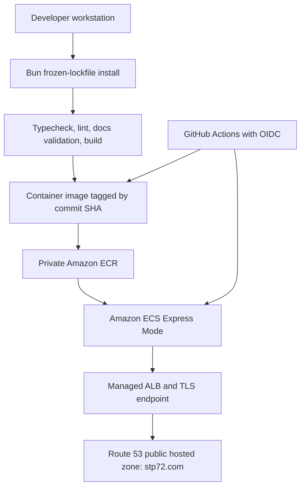

# Chapter 10: Containerization, Local Deployment & AWS ECS Express Mode

## 10.1 Status and Scope

This chapter documents the **approved target architecture**, not a completed deployment. On 2026-08-31, the AWS account was verified to have a public Route 53 hosted zone for `stp72.com.`, but no `stp72-company` ECR repository, no App Runner service, and no ECS cluster in `eu-central-1`. The discovery session used the account root principal; do not use that identity for ordinary provisioning or deployment work.

The repository now has a deterministic container definition and an ECS Express deployment workflow, but it cannot run until the required AWS resources and GitHub variables are configured:

- The prior workflow failed before dependency installation because it enabled npm caching without an npm-compatible lockfile.
- The replacement workflow uses `bun install --frozen-lockfile`; `bun.lock` is the only committed lockfile.
- The workflow targets **ECS Express Mode** using AWS's official create-or-update deployment action.
- The Docker builder uses Bun, then copies only Nitro's `.output` into a non-root Node.js 24 runtime image.

No command in this chapter should be executed until the corresponding implementation/deployment phase is approved.

## 10.2 Approved Architecture



AWS closed App Runner to new customers and recommends ECS Express Mode as the migration path. ECS Express Mode keeps the container-first operational model while creating the Fargate service, Application Load Balancer, networking, and autoscaling defaults in the AWS account. [AWS availability change](https://docs.aws.amazon.com/apprunner/latest/dg/apprunner-availability-change.html)

## 10.3 Package Manager and Runtime Policy

### Decision: Bun for dependencies; Node.js 24 for production runtime

`bun.lock` and [`bunfig.toml`](../bunfig.toml) are the dependency source of truth. `bunfig.toml` also sets a 24-hour minimum release age, reducing exposure to newly published dependency versions. Use:

```sh
bun install --frozen-lockfile
bun run dev
bun run build
```

Do not run `npm ci` or introduce a `package-lock.json` unless the team explicitly reverses this decision and migrates away from `bun.lock`. `npm ci` requires an npm lockfile. [npm documentation](https://docs.npmjs.com/cli/v11/commands/npm-ci/)

The final container remains a non-root Node.js 24/Nitro runner. The future builder must install dependencies with Bun and copy only `.output` into that Node runtime. Preserve `NITRO_PRESET=node-server` because the custom server entry expects a standalone Node server bundle.

## 10.4 Local Container Deployment

The Docker and Compose definitions use the same deterministic Bun-builder design as CI and are appropriate for local smoke testing.

```sh
docker compose up -d
docker compose ps
docker compose logs -f
```

The current health probe requests `http://127.0.0.1:3000/hu`. A healthy response confirms the localized SSR route can render. Stop the local service with:

```sh
docker compose down
```

## 10.5 CI/CD Requirements Before Cloud Provisioning

The prior GitHub Actions run failed in `actions/setup-node` because its `cache: npm` setting searches for `package-lock.json`, `npm-shrinkwrap.json`, or `yarn.lock`; none exists. The raw run is [33301445214](https://github.com/STP72-dev/STP72-company/actions/runs/33301445214). The replacement workflow eliminates that npm path.

The implemented workflow:

1. Set up Bun and run `bun install --frozen-lockfile`.
2. Run `bun x tsc --noEmit`, `bun run lint`, documentation validation, and `bun run build`.
3. Build the container only after validation passes.
4. Push an immutable commit-SHA tag or digest to ECR.
5. Deploy that exact image reference to ECS Express Mode through a GitHub `production` environment gate.

Local validation on 2026-09-01 confirmed the Docker build, TypeScript check, and `/hu` container health check. Repository-wide lint remains a release gate and currently reports 106 pre-existing Prettier errors under `src/`; they must be formatted before the first successful pipeline run.

Before the first run, create a GitHub Environment named `production`, restrict it to the `main` branch, and add required reviewers. Set these as **repository variables**; they are not credentials, but they avoid hard-coding account design in the repository. The entire AWS release job is protected by this environment, so its OIDC identity is stable and reviewable.

| Variable                      | Example / purpose                                                         |
| ----------------------------- | ------------------------------------------------------------------------- |
| `AWS_REGION`                  | `eu-central-1`                                                            |
| `AWS_ACCOUNT_ID`              | Target AWS account ID; used to reject credentials from the wrong account. |
| `ECR_REPOSITORY`              | `stp72-company`                                                           |
| `AWS_ROLE_TO_ASSUME`          | GitHub OIDC deployment-role ARN.                                          |
| `ECS_CLUSTER`                 | `default` unless a dedicated cluster is created.                          |
| `ECS_SERVICE`                 | `stp72-company`                                                           |
| `ECS_TASK_EXECUTION_ROLE_ARN` | Task execution role ARN.                                                  |
| `ECS_INFRASTRUCTURE_ROLE_ARN` | ECS Express infrastructure-role ARN.                                      |

The workflow deliberately uses no static AWS access-key secret. GitHub OIDC supplies short-lived credentials and `allowed-account-ids` rejects a successful assumption into an unintended account. [AWS credential action documentation](https://github.com/aws-actions/configure-aws-credentials)

Do not use a mutable `latest` tag as the rollback source. ECR supports scanning and immutable tags; select a lifecycle policy that retains the current and a defined number of prior verified releases. [Amazon ECR documentation](https://docs.aws.amazon.com/AmazonECR/latest/userguide/image-tag-mutability.html)

## 10.6 AWS Prerequisites

### Current AWS account facts

| Resource             | Status                            | Next action                                              |
| -------------------- | --------------------------------- | -------------------------------------------------------- |
| Region               | `eu-central-1`                    | Keep as the intended deployment region.                  |
| ECR repository       | Absent                            | Create `stp72-company` after CI remediation is approved. |
| ECS Express service  | Absent                            | Create after the first validated image exists.           |
| Route 53 hosted zone | `stp72.com.` exists and is public | Use for later DNS/certificate validation.                |

Before provisioning, sign in through an IAM Identity Center administrative user or assume an administrative role with temporary credentials. AWS recommends keeping the root principal for tasks that require root access only. [AWS root-user best practices](https://docs.aws.amazon.com/IAM/latest/UserGuide/root-user-best-practices.html)

### IAM model

Three roles have separate responsibilities:

| Role                    | Principal                     | Purpose                                                                |
| ----------------------- | ----------------------------- | ---------------------------------------------------------------------- |
| GitHub deployment role  | GitHub Actions OIDC           | Validate/push ECR image and initiate the approved ECS deployment flow. |
| ECS task execution role | `ecs-tasks.amazonaws.com`     | Pull the private ECR image and write application logs.                 |
| ECS infrastructure role | ECS Express service principal | Lets Express Mode provision and manage required infrastructure.        |

The GitHub OIDC trust must require `aud=sts.amazonaws.com` and restrict `sub` to `repo:STP72-dev/STP72-company:environment:production`. The GitHub `production` environment must itself permit only the `main` branch and require reviewers. GitHub and AWS both require explicit identity-provider controls for this shared OIDC provider. [GitHub OIDC setup](https://docs.github.com/en/actions/how-tos/secure-your-work/security-harden-deployments/oidc-in-aws), [AWS IAM controls](https://docs.aws.amazon.com/IAM/latest/UserGuide/id_roles_providers_oidc_secure-by-default.html)

Checked-in, account-neutral IAM templates live in [`.aws/iam/`](../.aws/iam/README.md). Render the `<AWS_ACCOUNT_ID>` placeholder only in the approved non-root administrator session; never commit rendered account identifiers.

## 10.7 ECS Express Mode First Deployment

ECS Express Mode needs a private ECR image, task execution role, and infrastructure role. With the default network configuration, it creates an internet-facing ALB in the default VPC and public subnets. [AWS getting-started guide](https://docs.aws.amazon.com/AmazonECS/latest/developerguide/express-service-getting-started.html)

Before creating the service:

1. Confirm ECS Express Mode is available to the selected account in `eu-central-1`; if it is unavailable, stop and use the standard ECS/Fargate fallback rather than improvising a different service.
2. Confirm the new CI workflow has passed on a clean commit.
3. Confirm the commit-SHA image exists in the private ECR repository and has been reviewed for scan findings.
4. Configure container port `3000` and initial HTTP health path `/hu`.
5. Record the deployed image digest and service endpoint in the deployment record.

Validate the first deployment by checking service health, application logs, and a 200 response from `/hu`. A failure must leave the last healthy immutable image available for redeployment.

## 10.8 Route 53 and `stp72.com` Cutover

The public `stp72.com.` hosted zone already exists. Associate the selected hostname only after the service is healthy at its AWS-provided endpoint.

1. Choose the production hostname (`stp72.com` or a subdomain) and record the current DNS target before changing it.
2. Create the records required by the ECS/ALB deployment and certificate-validation flow.
3. Wait for the certificate to be issued and DNS to resolve to the healthy service.
4. Validate HTTPS, the localized root redirect, `/hu`, the English route, and a nested solution page.
5. Keep the prior DNS target until post-cutover monitoring is healthy.

Route 53 is the DNS authority; no external DNS transfer is required. DNS or certificate changes are production changes and require explicit approval and a rollback record.

## 10.9 Operational Runbook

### Release validation

- Confirm the GitHub validation job completed before image publication.
- Confirm the deployed service references the intended SHA/digest.
- Check the application health path, container logs, and image scan findings.
- Confirm the prior release remains available under the ECR lifecycle policy.

### Rollback

1. Identify the last verified image digest or SHA tag.
2. Redeploy that exact immutable image through the ECS Express deployment path.
3. Confirm service health and `/hu` before declaring rollback complete.
4. If a domain change caused the incident, restore the preceding Route 53 record target.

### Security boundaries

- Never commit AWS credentials, role ARNs that expose private account design unnecessarily, or Route 53 change tokens.
- Do not grant broad administrator policies to GitHub Actions. Scope the OIDC role to the protected production environment, ECR repository, and required ECS actions.
- Review ECR scans before production promotion and retain only the releases required for rollback/audit.
