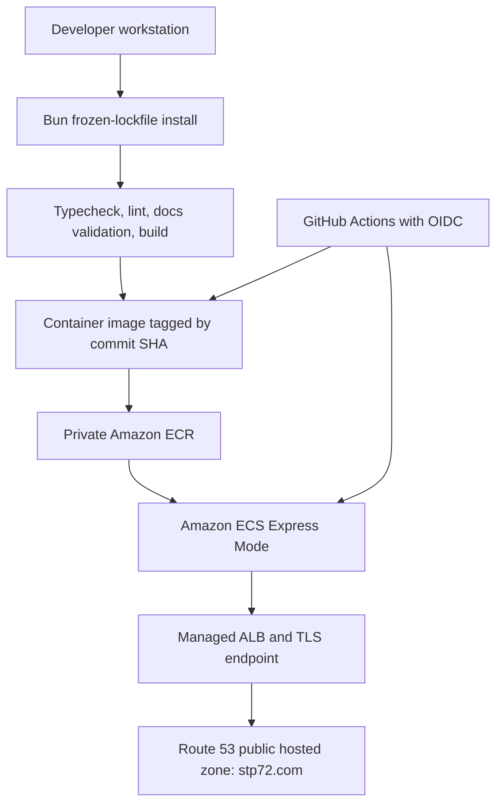

# Chapter 10: Containerization, Local Deployment & AWS ECS Express Mode

## 10.1 Status and Scope

The approved architecture is now deployed and healthy in `eu-central-1`. On 2026-09-01, GitHub Actions run [`33561626212`](https://github.com/STP72-dev/STP72-company/actions/runs/33561626212) completed both validation and release jobs successfully. ECS Express Mode reports the service as `ACTIVE`; its deployed image is the immutable commit-SHA release beginning `98a6d63`; the `/hu`, `/en/ai-solutions`, and `/en/ai-solutions/ai-agents` routes each returned HTTP 200 from the AWS-generated HTTPS endpoint; and the CloudWatch startup logs were clean.

The remaining production-release work is the intentionally deferred `stp72.com` DNS and certificate cutover. Do not use the AWS root principal for that work or any routine inspection, provisioning, or deployment.

The release design is deterministic:

- `bun.lock` is the only committed dependency lockfile and CI uses `bun install --frozen-lockfile`.
- The workflow targets **ECS Express Mode** using AWS's official create-or-update deployment action.
- The Docker builder uses Bun, then copies only Nitro's `.output` into a non-root Node.js 24 runtime image.

## 10.2 Approved Architecture



AWS closed App Runner to new customers and recommends ECS Express Mode as the migration path. ECS Express Mode keeps the container-first operational model while creating the Fargate service, Application Load Balancer, networking, and autoscaling defaults in the AWS account. [AWS availability change](https://docs.aws.amazon.com/apprunner/latest/dg/apprunner-availability-change.html)

## 10.3 Package Manager and Runtime Policy

### Decision: Bun for dependencies; Node.js 24 for production runtime

`bun.lock` and [`bunfig.toml`](../bunfig.toml) are the dependency source of truth. `bunfig.toml` also sets a 24-hour minimum release age, reducing exposure to newly published dependency versions. Use:

```sh
bun install --frozen-lockfile
bun run dev
bun run build
```

Do not run `npm ci` or introduce a `package-lock.json` unless the team explicitly reverses this decision and migrates away from `bun.lock`. `npm ci` requires an npm lockfile. [npm documentation](https://docs.npmjs.com/cli/v11/commands/npm-ci/)

The final container remains a non-root Node.js 24/Nitro runner. The future builder must install dependencies with Bun and copy only `.output` into that Node runtime. Preserve `NITRO_PRESET=node-server` because the custom server entry expects a standalone Node server bundle.

## 10.4 Local Container Deployment

The Docker and Compose definitions use the same deterministic Bun-builder design as CI and are appropriate for local smoke testing.

```sh
docker compose up -d
docker compose ps
docker compose logs -f
```

The current health probe requests `http://127.0.0.1:3000/hu`. A healthy response confirms the localized SSR route can render. Stop the local service with:

```sh
docker compose down
```

## 10.5 CI/CD Release Controls

The early migration run failed in `actions/setup-node` because its `cache: npm` setting searches for `package-lock.json`, `npm-shrinkwrap.json`, or `yarn.lock`; none exists. The replacement workflow eliminates that npm path. Two later, distinct CI issues were corrected: checked-in agent-skill symlinks referenced a developer-machine absolute path, and the agent-document validator searched generated `node_modules` skill files after installation. The skills are now repository-contained and validation excludes generated dependencies.

The implemented workflow:

1. Set up Bun and run `bun install --frozen-lockfile`.
2. Run `bun x tsc --noEmit`, `bun run lint`, documentation validation, and `bun run build`.
3. Build the container only after validation passes.
4. Push an immutable commit-SHA tag or digest to ECR.
5. Deploy that exact image reference to ECS Express Mode through a GitHub `production` environment gate.

The successful 2026-09-01 pipeline proved the complete gate: type checking, linting, Prettier check, strict agent-document validation, production build, container build, ECR publication, and ECS Express deployment. Local Docker smoke testing also confirmed HTTP 200 for `/hu`, `/en/ai-solutions`, and `/en/ai-solutions/ai-agents`. Lint has no errors; the remaining Fast Refresh notices are warnings. Prettier check passes.

The GitHub `production` environment is configured for `main` deployments with reviewer protection. The following **repository variables** are configured after role provisioning; they are not credentials and keep account-specific configuration out of source control. The entire AWS release job is protected by this environment, so its OIDC identity is stable and reviewable.

| Variable                      | Example / purpose                                                         |
| ----------------------------- | ------------------------------------------------------------------------- |
| `AWS_REGION`                  | `eu-central-1`                                                            |
| `AWS_ACCOUNT_ID`              | Target AWS account ID; used to reject credentials from the wrong account. |
| `ECR_REPOSITORY`              | `stp72-company`                                                           |
| `AWS_ROLE_TO_ASSUME`          | GitHub OIDC deployment-role ARN.                                          |
| `ECS_CLUSTER`                 | `default` unless a dedicated cluster is created.                          |
| `ECS_SERVICE`                 | `stp72-company`                                                           |
| `ECS_TASK_EXECUTION_ROLE_ARN` | Task execution role ARN.                                                  |
| `ECS_INFRASTRUCTURE_ROLE_ARN` | ECS Express infrastructure-role ARN.                                      |

The workflow deliberately uses no static AWS access-key secret. GitHub OIDC supplies short-lived credentials and `allowed-account-ids` rejects a successful assumption into an unintended account. [AWS credential action documentation](https://github.com/aws-actions/configure-aws-credentials)

Do not use a mutable `latest` tag as the rollback source. ECR supports scanning and immutable tags; select a lifecycle policy that retains the current and a defined number of prior verified releases. [Amazon ECR documentation](https://docs.aws.amazon.com/AmazonECR/latest/userguide/image-tag-mutability.html)

## 10.6 AWS Resources and IAM Model

### Current AWS account facts

| Resource             | Status                                         | Operational note                                                                 |
| -------------------- | ---------------------------------------------- | -------------------------------------------------------------------------------- |
| Region               | `eu-central-1`                                 | Production region.                                                               |
| ECR repository       | Created; commit-SHA release image is published | Re-check scan-on-push, tag immutability, and lifecycle retention during cutover. |
| GitHub OIDC provider | Created and in use                             | Issues short-lived release credentials; no static AWS keys are stored in GitHub. |
| ECS Express service  | `ACTIVE`                                       | Runs one to two tasks with port `3000` and HTTP health path `/hu`.               |
| CloudWatch logs      | Created and observed                           | Startup log stream was clean during release verification.                        |
| Route 53 hosted zone | `stp72.com.` exists and is public              | Apex rollback record still must be captured before any DNS change.               |
| ACM / custom domain  | Not yet configured for `stp72.com` cutover     | Certificate, listener rule, and Route 53 alias remain the final release phase.   |

Before provisioning, sign in through an IAM Identity Center administrative user or assume an administrative role with temporary credentials. AWS recommends keeping the root principal for tasks that require root access only. [AWS root-user best practices](https://docs.aws.amazon.com/IAM/latest/UserGuide/root-user-best-practices.html)

### IAM model

Three roles have separate responsibilities:

| Role                    | Principal                     | Purpose                                                                |
| ----------------------- | ----------------------------- | ---------------------------------------------------------------------- |
| GitHub deployment role  | GitHub Actions OIDC           | Validate/push ECR image and initiate the approved ECS deployment flow. |
| ECS task execution role | `ecs-tasks.amazonaws.com`     | Pull the private ECR image and write application logs.                 |
| ECS infrastructure role | ECS Express service principal | Lets Express Mode provision and manage required infrastructure.        |

The GitHub OIDC trust requires `aud=sts.amazonaws.com` and the exact protected `production`-environment `sub` claim emitted by this organization. This organization uses GitHub's immutable-ID subject-claim customization, so the deployed trust policy intentionally uses the verified immutable-ID form rather than the generic human-readable subject. Do not simplify or replace it without first inspecting a fresh issued token. The GitHub `production` environment itself permits only `main` and has reviewer protection. [GitHub OIDC setup](https://docs.github.com/en/actions/how-tos/secure-your-work/security-harden-deployments/oidc-in-aws), [AWS IAM controls](https://docs.aws.amazon.com/IAM/latest/UserGuide/id_roles_providers_oidc_secure-by-default.html)

Checked-in, account-neutral IAM templates live in [`.aws/iam/`](../.aws/iam/README.md). Render the `<AWS_ACCOUNT_ID>` placeholder only in the approved non-root administrator session; never commit rendered account identifiers.

## 10.7 ECS Express Mode Deployment Record

ECS Express Mode needs a private ECR image, task execution role, and infrastructure role. With the default network configuration, it creates an internet-facing ALB in the default VPC and public subnets. [AWS getting-started guide](https://docs.aws.amazon.com/AmazonECS/latest/developerguide/express-service-getting-started.html)

ECS Express Mode was available and selected; no App Runner or standard ECS/Fargate fallback was required. The initial deployment used container port `3000`, HTTP health path `/hu`, CPU `1024`, memory `2048`, and minimum/maximum task counts of one and two.

| Verification         | Observed result                                                         |
| -------------------- | ----------------------------------------------------------------------- |
| GitHub Actions       | Run `33561626212`: validation and release jobs succeeded.               |
| Immutable release    | ECS Express deployed the commit-SHA image beginning `98a6d63`.          |
| ECS Express          | Service is `ACTIVE`.                                                    |
| Application routes   | `/hu`, English hub, and nested English solution each returned HTTP 200. |
| Runtime observations | CloudWatch startup logs were clean; no application error was observed.  |

The deployment was initially blocked by a least-privilege omission (`ecr:BatchGetImage`) and, in a new AWS account, missing ECS/ELB/Application Auto Scaling service-linked roles. Both were resolved through the non-root administrative session. The service-linked roles are one-time account bootstrap resources; the GitHub deployment role does not have permission to create them.

## 10.8 Route 53 and `stp72.com` Cutover

The public `stp72.com.` hosted zone already exists, and the ECS Express service is healthy at its AWS-provided HTTPS endpoint. The custom-domain cutover has not yet begun. In particular, no current apex record set or rollback target has been recorded in this release phase, and no ACM certificate or production Route 53 alias has been changed.

1. Choose the production hostname (`stp72.com` or a subdomain) and record the current DNS target before changing it.
2. Create the records required by the ECS/ALB deployment and certificate-validation flow.
3. Wait for the certificate to be issued and DNS to resolve to the healthy service.
4. Validate HTTPS, the localized root redirect, `/hu`, the English route, and a nested solution page.
5. Keep the prior DNS target until post-cutover monitoring is healthy.

Route 53 is the DNS authority; no external DNS transfer is required. Before starting DNS work, capture the complete current apex `A` and `AAAA` record sets and their targets as the rollback record. DNS and certificate changes remain production changes that must preserve this rollback information.

## 10.9 Operational Runbook

### Release validation

- Confirm the GitHub validation job completed before image publication.
- Confirm the deployed service references the intended SHA/digest.
- Check the application health path, container logs, and image scan findings.
- Confirm the prior release remains available under the ECR lifecycle policy.

### Rollback

1. Identify the last verified image digest or SHA tag.
2. Redeploy that exact immutable image through the ECS Express deployment path.
3. Confirm service health and `/hu` before declaring rollback complete.
4. If a domain change caused the incident, restore the preceding Route 53 record target.

### Security boundaries

- Never commit AWS credentials, role ARNs that expose private account design unnecessarily, or Route 53 change tokens.
- Do not grant broad administrator policies to GitHub Actions. Scope the OIDC role to the protected production environment, ECR repository, and required ECS actions.
- Review ECR scans before production promotion and retain only the releases required for rollback/audit.
