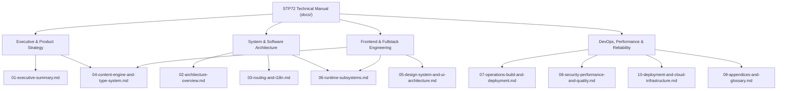

# STP72 Foundation — Technical Architecture & Systems Manual

Welcome to the definitive technical documentation manual for **STP72 Foundation** (`STP72-company`), an enterprise-grade corporate platform and technical solutions catalogue built with **TanStack Start**, **React 19**, **TypeScript**, **Nitro**, and **Tailwind CSS v4**.

---

## 🧭 Documentation Navigation & Reading Paths

This documentation is structured into modular chapters that cater to different stakeholder perspectives:



### Reading Paths

| Audience                         | Primary Chapters                                                                                                                                                                            | Key Focus Areas                                                                                                                     |
| :------------------------------- | :------------------------------------------------------------------------------------------------------------------------------------------------------------------------------------------ | :---------------------------------------------------------------------------------------------------------------------------------- |
| **Stakeholders & Product Leads** | [Ch 01](01-executive-summary.md), [Ch 04](04-content-engine-and-type-system.md)                                                                                                             | Value proposition, SME digital transformation positioning, evidence-based engineering claims, solutions taxonomy.                   |
| **System Architects**            | [Ch 02](02-architecture-overview.md), [Ch 03](03-routing-and-i18n.md), [Ch 06](06-runtime-subsystems.md), [Ch 10](10-deployment-and-cloud-infrastructure.md)                                | File-based SSR architecture, two-way slug resolution invariants, hardened error recovery, AWS cloud topology.                       |
| **Frontend Engineers**           | [Ch 04](04-content-engine-and-type-system.md), [Ch 05](05-design-system-and-ui-architecture.md), [Ch 06](06-runtime-subsystems.md)                                                          | TypeScript content contracts, IBM Plex/Carbon design system, OKLCH tokens, zero-FOUC theme hydration, client search.                |
| **DevOps & Platform Engineers**  | [Ch 07](07-operations-build-and-deployment.md), [Ch 08](08-security-performance-and-quality.md), [Ch 10](10-deployment-and-cloud-infrastructure.md), [Ch 09](09-appendices-and-glossary.md) | Bun-locked builds, multi-stage Docker packaging, GitHub Actions OIDC CI/CD, Amazon ECR, ECS Express Mode, and operational runbooks. |

---

## 📚 Chapters Directory

1. [**Chapter 01: Executive Summary & System Rationale**](01-executive-summary.md)
   - High-level business mission, target SME demographic, factual positioning, evidence-based marketing, and core engineering philosophy.
2. [**Chapter 02: Architectural Foundations & System Topology**](02-architecture-overview.md)
   - Fullstack topology: TanStack Start, Nitro server layer, React 19 execution model, component tree topology, and request/response life cycles.
3. [**Chapter 03: Routing, Localization & Invariant Navigation**](03-routing-and-i18n.md)
   - Canonical conceptual page key architecture, two-way slug resolution, multi-tier URL layout, strict 404 boundaries, and link component isolation.
4. [**Chapter 04: Content Engine & Type Safety Contracts**](04-content-engine-and-type-system.md)
   - Decoupled content architecture, zero-inline copy rule, 3 flagship solution families, 13 sub-solutions, 2 supporting capabilities, and engineering evidence models.
5. [**Chapter 05: Design System, Tokens & UI Architecture**](05-design-system-and-ui-architecture.md)
   - IBM Plex typography, flat neutral surface layers, zero-radius geometry, OKLCH color spaces, accessibility glyphs, and AI transparency disclosure components.
6. [**Chapter 06: Core Runtime Subsystems**](06-runtime-subsystems.md)
   - Hardened SSR exception capture & unhandled h3 unwrapping, client-side weighted fuzzy search indexer, zero-FOUC theme engine, and dynamic hreflang SEO generation.
7. [**Chapter 07: Operations, Build Pipeline & Deployment**](07-operations-build-and-deployment.md)
   - Toolchain orchestration (`bun`, `vite`, `nitro`, `@tailwindcss/vite`), build artifacts, containerization/serverless targets, and operational runbook.
8. [**Chapter 08: Security, Performance & Quality Assurance**](08-security-performance-and-quality.md)
   - CSRF protection for server functions, error leakage prevention, client bundle efficiency, Core Web Vitals, and WCAG accessibility standards.
9. [**Chapter 09: Appendices, Route Matrix & Domain Glossary**](09-appendices-and-glossary.md)
   - Complete route map matrix, taxonomy cross-reference, status vocabulary definitions, file inventory, and troubleshooting matrices.
10. [**Chapter 10: Containerization, Local Deployment & AWS Cloud Architecture**](10-deployment-and-cloud-infrastructure.md)

- Bun-locked builds, multi-stage Docker packaging, Docker Compose orchestration, Amazon ECR and ECS Express Mode infrastructure, GitHub Actions OIDC CI/CD, Route 53 cutover, and operational runbooks.

---

## ⚡ Quick Start for Developers

### Option 1: Using Docker Compose (Zero Configuration)

```bash
# Build and start the containerized platform
docker compose up -d

# Open in browser: http://localhost:3000
```

### Option 2: Local Node.js / Bun Development

```bash
# Clone the repository
git clone <repository-url>
cd STP72-company

# Install dependencies
bun install --frozen-lockfile

# Start development server with HMR and SSR
bun run dev   # or: npm run dev

# Build for production
bun run build # or: npm run build
```
